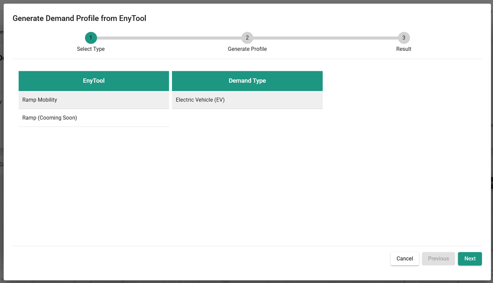
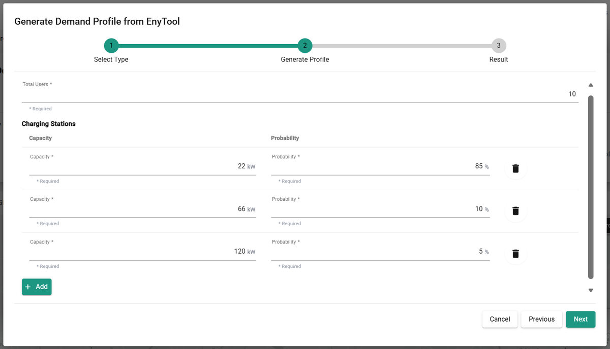
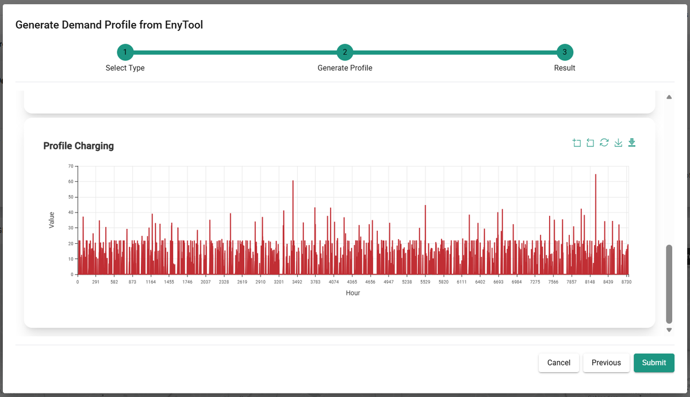

---
tags:
  - web-app
  - how-to
---

# RAMP tool suite

The RAMP tool suite specializes in synthetic demand modelling for cases where measured datasets are unavailable or incomplete. It generates stochastic load profiles (domestic, hot water, EV, and more).

**RAMP Mobility** is a dedicated sister repository focused on electric mobility demand modelling. It provides demand profiles for EV fleets and integrates them into energy system optimization. The complete RAMP Mobility documentation is available on [GitHub](https://github.com/RAMP-project/RAMP-mobility/blob/master/docs/getting_started.md).

## In EnyTool

- RAMP (base) generates demand profiles for buildings, districts, and micro-grids within EnyTool workflows.
- RAMP Mobility is integrated: you can model EV-based loads and mobility-related demand growth, and include them in scenario planning or network sizing.

Key benefits:

- Enables richer modelling for sites without measured loads.
- Supports future-proofing by including EV loads and mobility transitions.
- Plugs into district/building energy models in EnyTool to assess flexibility, grid impact, and network sizing.

## Generate an electric mobility demand profile

To generate an electric mobility demand profile, you configure the following parameters:

- **Total Users**: the number of EVs to simulate.
- **Charging Station Capacity [kW]**: the installed capacity of available chargers. 11 kW or 22 kW are standard values for domestic charging stations; 66 kW or 120 kW may be available at public (fast-charging) stations.
- **Charging Station Probability [%]**: the probability that users charge their car at that type of charging station.

You must create at least two types of charging stations.

1. Select **Ramp Mobility**.

   

2. Add parameters. The charging station probabilities must sum to 100%.

   

3. After a couple of minutes, three profiles are generated.

   

Before clicking **Submit**, three profiles are available to download:

- The **mobility profile** (W) is the energy used by all EVs as they drive.
- The **usage profile** (number of EVs) is the number of EVs driving at any given time.
- The **charging profile** (kWh) is the electricity provided by all charging stations to the EV fleet.

Click **Submit** to add the charging profile as a demand.

## Reference

The RAMP-mobility tool was developed in collaboration with:

- A. Mangipinto, F. Lombardi, F. Sanvito, M. Pavičević, S. Quoilin, E. Colombo, "Impact of mass-scale deployment of electric vehicles and benefits of smart charging across all European countries," Applied Energy, 2022, [doi.org/10.1016/j.apenergy.2022.118676](https://doi.org/10.1016/j.apenergy.2022.118676).
- A. Mangipinto, F. Lombardi, F. Sanvito, S. Quoilin, M. Pavičević, E. Colombo, "RAMP-mobility: time series of electric vehicle consumption and charging strategies for all European countries," EMP-E, 2020, [doi.org/10.13140/RG.2.2.29560.26880](https://doi.org/10.13140/RG.2.2.29560.26880).
- F. Lombardi, S. Balderrama, S. Quoilin, E. Colombo, "Generating high-resolution multi-energy load profiles for remote areas with an open-source stochastic model," Energy, 2019, [doi.org/10.1016/j.energy.2019.04.097](https://doi.org/10.1016/j.energy.2019.04.097).
