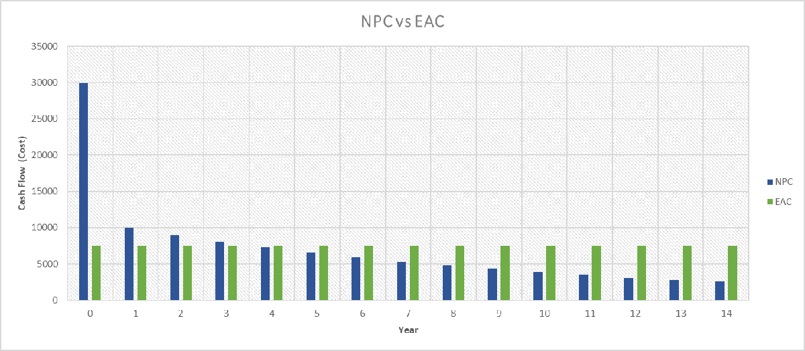
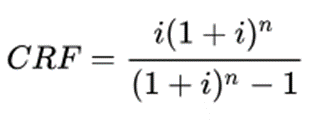

---
tags:
  - web-app
  - concepts
---

# Capital recovery factor

In Sympheny, the net present cost (NPC) is used to calculate the present value of all
cash flows over a project's lifetime, taking into account the time value of money. NPC
represents the discounted sum of all costs and revenues for every component in each
stage.

The equivalent annual cost (EAC) converts investments with different lifespans or cash
flow patterns into uniform annual payments, making it easy to compare projects.

To determine the EAC, start by calculating the capital recovery factor (CRF):

Here, *i* is the [discount rate](discounted-cash-flow-analysis.md) and *n* is the
number of years in a stage.

Finally, the EAC is calculated using the CRF, which transforms the total NPC into an
equal annual cost over the project's duration:

