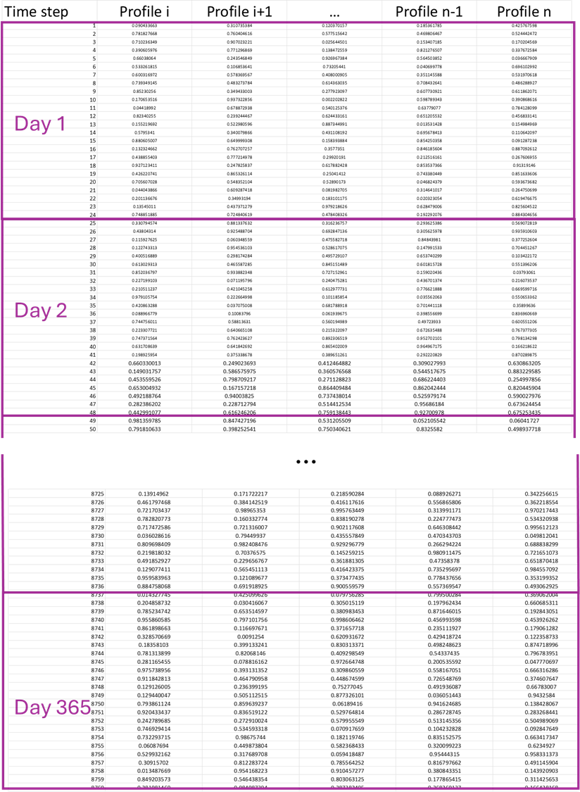
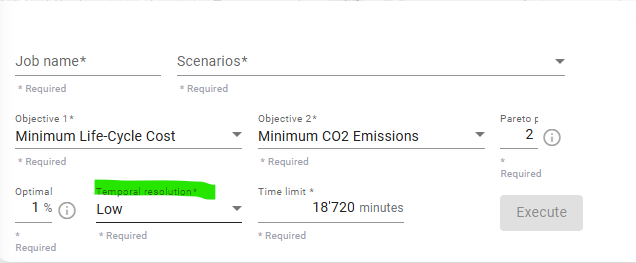

---
tags:
  - web-app
  - concepts
---

# Clustered profiles

## What are clustered profiles?

In the optimization process, machine-learning-generated clustered profiles are used to
improve performance. These profiles are created by grouping similar daily patterns
from all hourly input data in Sympheny, including energy demand, on-site resources, and
hourly tariffs. A reduced number of representative days (typical days) is selected, but
the model still operates in hourly time steps, so variations within each day are
preserved. The clustered profiles let Sympheny reconstruct the full annual profile from
these representative days.

!!! note
    These profiles remain consistent across all solutions within a given scenario.
    Clustering is performed for each [stage](stages.md), meaning all profiles used in
    a stage are clustered together.

## How are typical days generated?

The Sympheny engine selects a specific number of typical days based on the overall
hourly profiles provided and the chosen temporal resolution. These typical days are
selected from the 365 possible days in a year, based on patterns identified across the
combined profiles.

The clustered profiles are created from the selected typical days, which are repeated
throughout the year. For instance, if 20 typical days are chosen, each of these days,
comprising 24 hours, is used to represent the entire year, filling in the 365 days.

Each typical day is linked to specific data across all profiles, so the original days
are not mixed and matched — a typical day consistently represents the same day across
all profiles, rather than different days for different profiles. Each typical day
consists of 24 hours multiplied by the number of profiles.

For example, in a system with two demand profiles (heating and electricity), if a
typical day represents days 5, 8, 12, 23, 36, and 45 for the heating profile, it also
represents those same days for the electricity profile.

## Temporal resolution

The number of typical days selected is determined by the temporal resolution chosen in
the execution step.

The following settings define three resolution levels, each specifying the range of
typical days allowed and the corresponding error limits for load duration and total
sum:

- **Low**:
    - Minimum days: 5
    - Maximum days: 50
    - Max load duration error: 15%
    - Max sum error: 2%
- **Medium**:
    - Minimum days: 15
    - Maximum days: 100
    - Max load duration error: 7.5%
    - Max sum error: 1%
- **High**:
    - Minimum days: 30
    - Maximum days: 200
    - Max load duration error: 3%
    - Max sum error: 0.5%

The clustering process also ensures that the non-zero maximum and minimum values of
each profile are preserved, and maintains the linear combination of the profiles — the
peaks of two or more profiles occurring at the same time step are conserved.

## Clustered profiles metrics

The clustered profiles exhibit a similar load duration curve to the original profiles,
while ensuring both the sum and peaks of the profiles are preserved. In the results
folder, the `Output.xlsx` file, which you can download once the optimization is
complete, contains a sheet titled `Clustered Profiles-[Scenario Name].xlsx` with the
following metrics:

- **Number of typical time steps**: the total number of time steps, calculated as
  24 × typical days.
- **Max load duration error (%)**: the maximum load duration error across all profiles.
- **Max sum error (%)**: the maximum sum error across all profiles.

The error function used to calculate these metrics is the symmetric mean absolute
percentage error (SMAPE) for each profile, from which the maximum error percentage is
derived.
