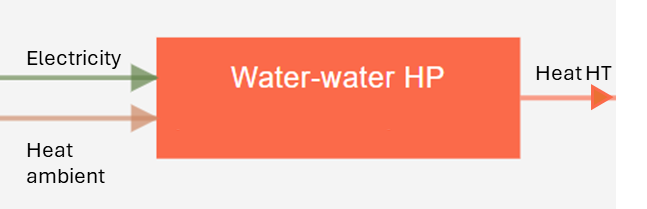
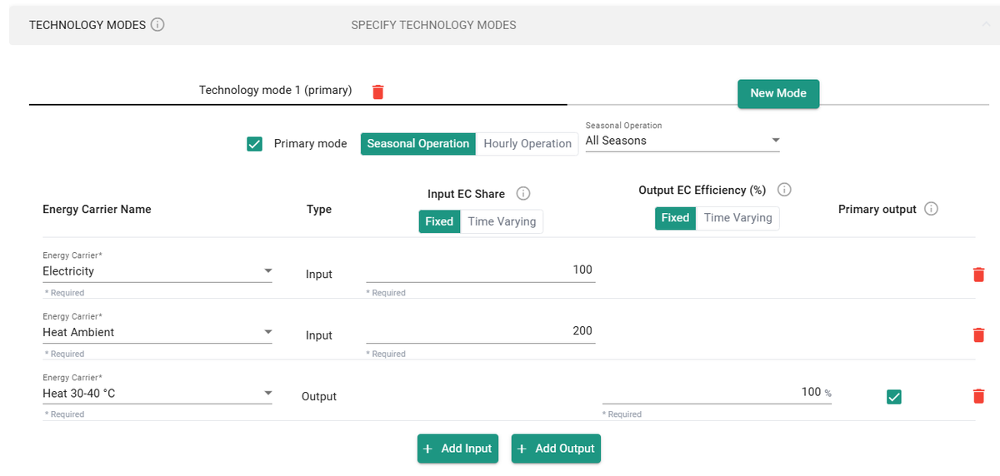
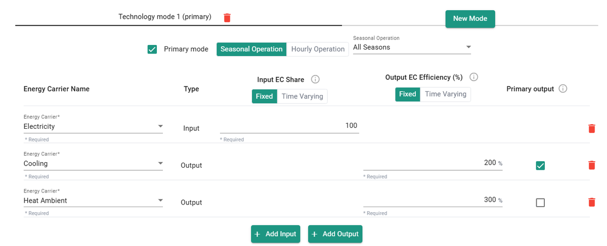
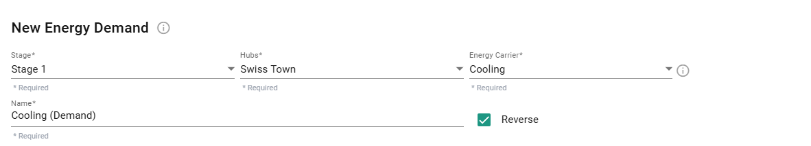
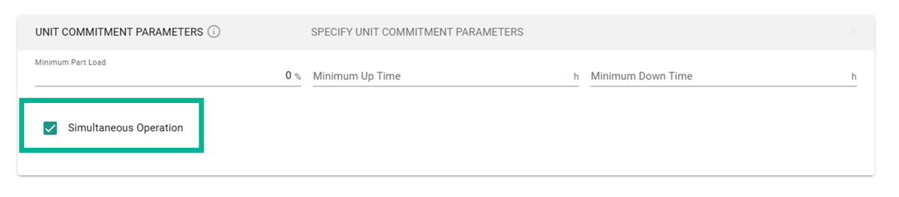
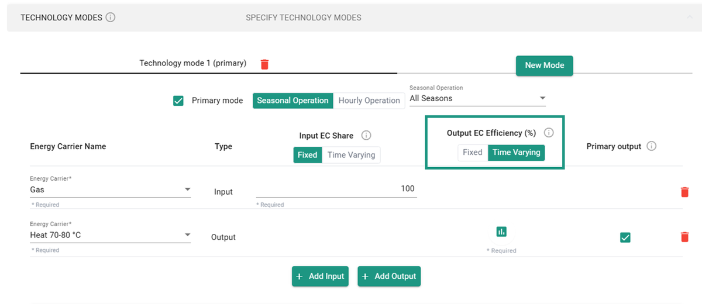
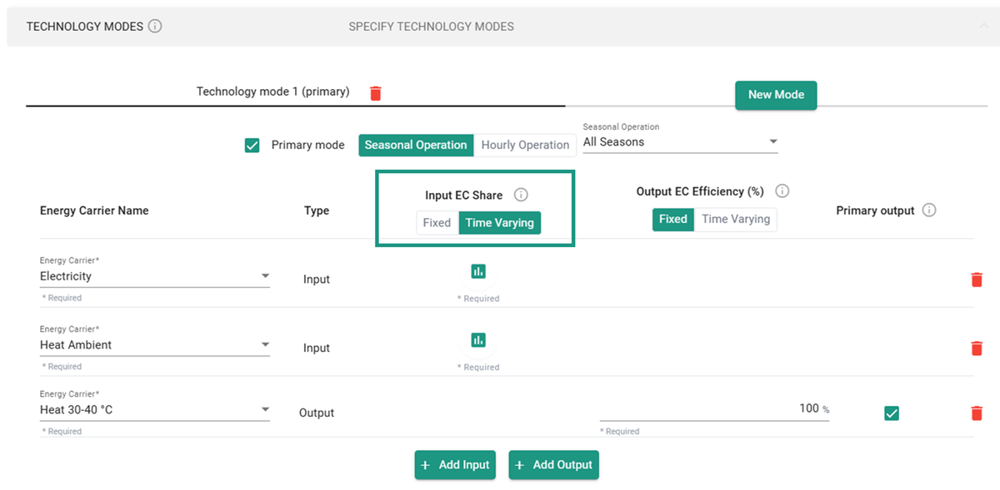
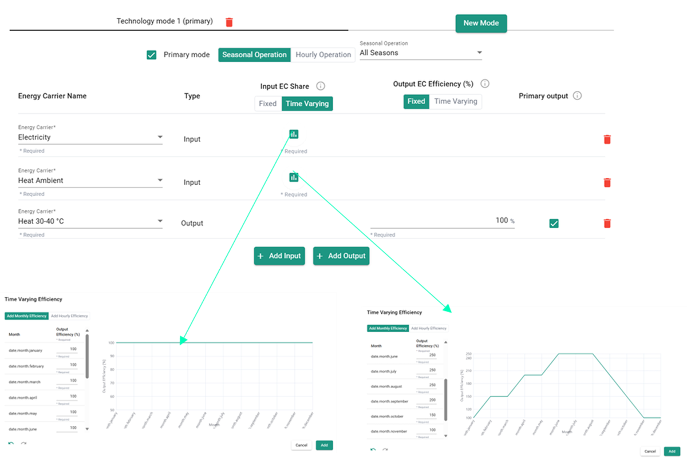

---
tags:
  - web-app
  - concepts
---

# Conversion technologies

Conversion technologies are systems that transform one or more energy carriers into
different types — for example, a gas boiler converting natural gas to heat. Each
technology is defined by:

- **Technical parameters**: efficiencies and technical limits.
- **Financial and environmental parameters**: investment costs (CAPEX), operational
  costs (OPEX), and embodied emissions.

For parameters, see
[Conversion technology parameters](parameters/conversion-technologies.md).

## Technology modes

A mode represents a specific operational regime with its own set of inputs, outputs,
and efficiencies. A single technology can have multiple modes to reflect different
seasonal or functional behaviors.

- **Example**: a reversible heat pump has a heating mode and a cooling mode, each with
  a distinct coefficient of performance (COP).
- **Configuration**: technical parameters are applied at the mode level, to allow for
  this granular operational modeling.

## Primary vs. non-primary modes

To ensure costs accurately reflect physical hardware requirements, modes are
categorized:

- **Primary mode**: a mode whose sizing must be reflected in cost and CO2 emissions.
  The technology's costs are derived from the capacity requirements of these modes.
- **Non-primary mode**: a "bonus" mode. Its capacity does not increase the technology's
  investment or operational costs, or its CO2 emissions — it represents secondary use
  of existing hardware.

## Mode capacity

The capacity of a specific mode is the maximum hourly sum of all primary outputs
recorded for that mode.

You can choose between two sizing behaviors:

- **Optimize mode capacity**: optionally enter a minimum and/or maximum installed
  capacity; the optimal capacity is selected within this range. If a minimum capacity
  is specified and the default option
  
  is selected, the installed capacity can be 0 or greater than the minimum.
- **Specify mode capacity**: installed capacity is held at a fixed value. Operating
  capacity (which does not influence investment costs) may be equal to or lower than
  installed capacity.

## Technology capacity

The technology capacity represents the installed capacity of the unit and is used for
cost and CO2 calculations. It equals the maximum total primary output summed across all
primary modes at any single point in time.

### Example calculation

- **Mode A peak (primary)**: 100 kW at hour 5.
- **Mode B peak (primary)**: peak of 200 kW at hour 10.
- **Peak of the sum of primary modes**: at hour 8, modes A and B produce a combined
  250 kW.

**Result**: the technology capacity is 250 kW.

## Mode efficiency

The efficiency of a mode indicates energy dissipation within systems. The sum of output
efficiencies represents the mode's total efficiency:

- A total efficiency of 100% means useful energy is conserved within the system.
- A total efficiency below 100% indicates useful energy is lost in the system — for
  example, heat losses in the technology, which are not modeled as a "waste heat" flow.
- A total efficiency above 100% indicates useful energy is created within the system —
  for example, useful heat extracted from the environment, which is not modeled as an
  "ambient air" flow.

### Example: heat pump

The efficiency of a standard input (with two inputs) is set as follows:

| Input EC       | Input share | Output EC | Output efficiency [%] |
| -------------- | ----------- | --------- | ---------------------- |
| Electricity     | 100         | HT heat   | **100**                |
| Ambient heat    | 200         |           |                        |

The calculation is:

**Output EC(i) = Sum of inputs × efficiency output(i)**

**HT heat = (100 + 200) × 100% = 300**

In this case, 100 units of electricity and 200 units of ambient heat produce 300 units
of HT heat. This corresponds to a yearly COP of 3.

In the app, the numbers are entered as follows:

### Example: chiller

For chillers, there are two ways to model cooling energy. The first method treats
cooling energy as a service, meaning the energy is generated and supplied. For example,
when modeling a chiller with an energy efficiency ratio (EER) of 2, the process is as
follows:

| Input EC    | Input share | Output EC | Output efficiency [%] |
| ----------- | ----------- | --------- | ---------------------- |
| Electricity | 100         | HT heat   | 300%                   |
|             |             | Cooling   | 200%                   |

This means that an input of 100 units of electricity produces 200 units of cooling
(based on an EER of 2) and 300 units of heating (assuming the electricity is fully
dissipated as heat).

100 units of electricity give, in this case, 300 units of HT heat and 200 units of
cooling, from which an EER of 2 is calculated. Here, the cumulative output efficiency
is greater than 100%, which reflects the "creation" of energy — because cooling energy
is treated as an additional service.

In the app, the numbers are entered as follows:

### Alternative method: chiller

There's also an alternative method where cooling energy is treated as an extraction of
energy demand. To use this method, set the cooling demand to "reversed." In this case,
the chiller can be modeled as a heat pump with an EER of 2 (or a COP of 3).

| Input EC    | Input share | Output EC | Output efficiency [%] |
| ----------- | ----------- | --------- | ---------------------- |
| Electricity | 100         | HT heat   | 100%                    |
| Cooling     | 200         |           |                        |

In the app, the numbers are entered as follows:

For this method, it's crucial that the **reverse** box is ticked for the cooling
demand in the Energy Demands step — this treats cooling as an extraction of heat.

## Simultaneity of operation

Different modes can operate simultaneously. To prevent this, leave the **simultaneous**
checkbox unchecked, indicating the mode cannot run with others. This may increase
optimization time.

Alternatively, a less computationally intensive option is to define a different
[seasonal or hourly operation](#seasonal-and-hourly-parameters) for each mode.

Some advanced parameters are not available to all plan tiers, but can be added through
add-on options. Contact customer support for a demo and to discuss customizing these
options to your needs.

## Seasonal and hourly parameters

You can enter time-varying efficiencies, either as monthly or hourly values. To do so,
select **Time varying** instead of **Fixed** for the output EC efficiency.

### The case of heat pumps

For heat pumps, if you want to apply a time-varying COP, modify the input EC share
rather than the output efficiency — the input EC share is what defines the COP
(= heat HT / electricity). See the example below:

| | Jan | Feb | Mar | Apr | May | Jun | Jul | Aug | Sep | Oct | Nov | Dec |
| --- | --- | --- | --- | --- | --- | --- | --- | --- | --- | --- | --- | --- |
| Electricity | 100 | 100 | 100 | 100 | 100 | 100 | 100 | 100 | 100 | 100 | 100 | 100 |
| Heat ambient | 100 | 150 | 150 | 200 | 200 | 250 | 250 | 250 | 200 | 150 | 100 | 100 |
| HT heat | 100% (stays fixed) | | | | | | | | | | | |
| COP | 2 | 2.5 | 2.5 | 3 | 3 | 3.5 | 3.5 | 3.5 | 3 | 2.5 | 2 | 2 |

