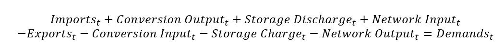

---
tags:
  - web-app
  - concepts
---

# Energy carriers

An energy carrier is any substance or medium that contains energy and can be
converted, stored, or delivered — a gaseous or solid fuel, an electric charge, thermal
energy, solar irradiance, and so on. You provide the energy carriers that are used
throughout the rest of the model. For parameters, see
[Energy carrier parameters](parameters/energy-carriers.md).

For every stage, hub, energy carrier, and time step, the following energy balance is
applied:

Where *t* is the time step.
