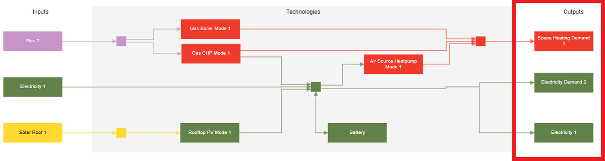

---
tags:
  - web-app
  - concepts
---

# Energy demands

Energy demands represent energy use. For example, a building uses heat for heating and electricity for appliances. An energy demand can also represent an industrial process or the district heating network of an entire region. Energy demands shape the results, since every demand must be satisfied at every time step. For parameters, see [Energy demands parameters](../parameters/energy-demands.md).

An energy demand is a profile that specifies the energy consumption for every hour of a year (8,760 hours) in kWh.

Make sure your custom profiles align with Sympheny's calendar year, which starts at 00:00 on Monday, January 1st and ends at 23:00 on December 31st. The year 2018 is a good reference, since it begins on a Monday and is not a leap year.

Energy demands appear on the right side of the energy diagram, alongside exports.

!!! tip
    During execution, all profiles are clustered, a proven method for reducing solving time without
    affecting the results. Hourly profiles in the results may therefore not have the exact same shape as the original energy demand profiles. See [Clustered profiles](clustered-profiles.md).
