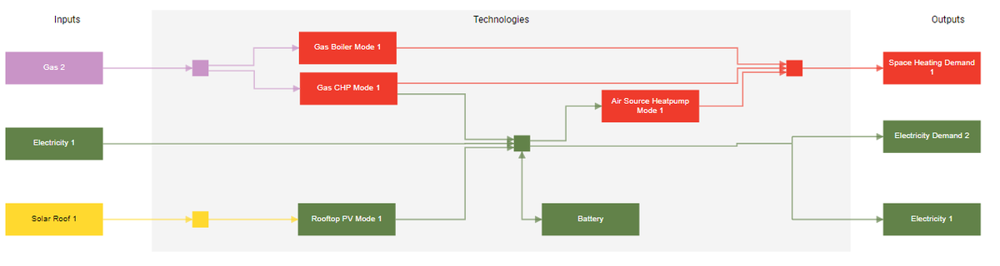

---
tags:
  - web-app
  - concepts
---

# Hubs

Sympheny lets you define different geographic areas or sites within your project as
hubs. A hub can be an individual building or a group of buildings treated as a single
unit. You specify the energy demands and exports for each hub, then explore ways to
supply that energy using imports, on-site resources, conversion technologies, and
storage technologies. Hubs can also be connected through a network technology, so you
can model how energy flows between them. For parameters, see
[Hubs parameters](parameters/hubs.md).
