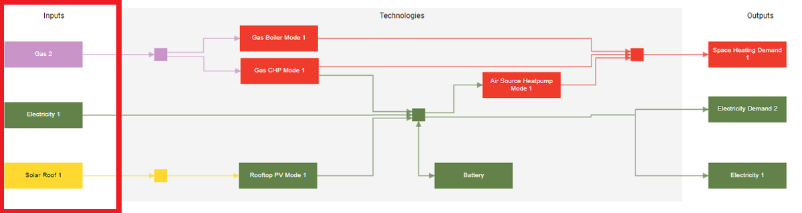

---
tags:
  - web-app
  - concepts
---

# Imports

Energy imported from outside the system. For example, purchasing grid electricity or natural gas. A resource, such as geothermal energy, can also be modeled as an import, without a cost and with a constraint on capacity or energy imported. Imports are configured together with exports in the [Imports & exports step](../step-by-step-guide/imports-exports-step.md) of the scenario editor. For resources with intermittent availability, see [On-site resources](on-site-resources.md).

Imports appear on the left side of the energy diagram, alongside on-site resources.

