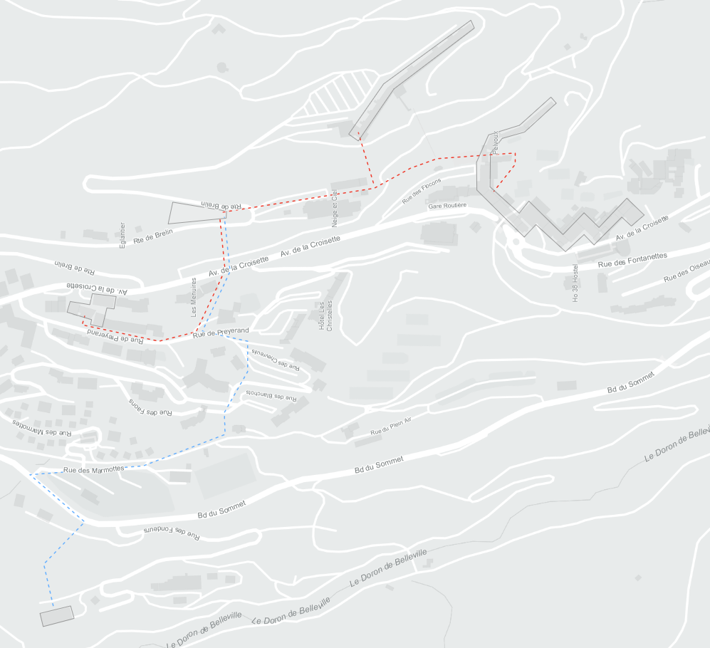

---
tags:
  - web-app
  - concepts
---

# Network technologies

Networks transport energy between [hubs](hubs.md). For example, the section of district heating network. They are modeled in two parts:

- **Network technology**: Defines the kind of energy transported, costs and embodied emissions.
- **Network link**: Defines the length, capacity, losses and connected hubs of a single network segment.

As for [conversion technologies](conversion-technologies.md), you can model multiple network link candidates and different network technologies and let Sympheny identify which are the better options. You can also specify the capacity, for example when modeling existing network links. The cost of a network link is a function of the network technology investment costs applied to the network link length and capacity.

You can draw network links on the map, where they will appear as dotted lines with the color of their energy carrier.

