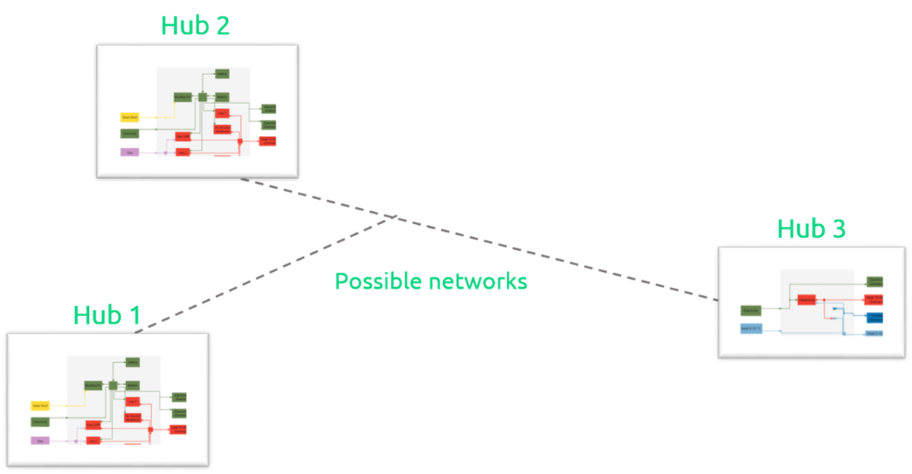

---
tags:
  - web-app
  - concepts
---

# Network technologies

Network technologies are connections that move energy between
[hubs](hubs.md) — for example, a district heating pipe or an electrical link.
Network link candidates are added in the
[Network links step](../how-to/modeling-scenarios/network-links-step.md) of the
scenario editor. For connections that move energy within a single hub, see
[Intra-hub networks](intra-hub-networks.md).

!!! info "Coming soon"
    A full concept page for network technologies is in preparation.
