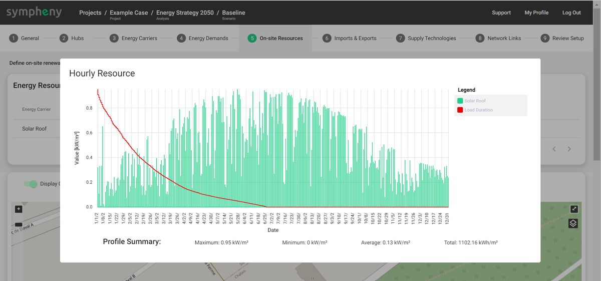
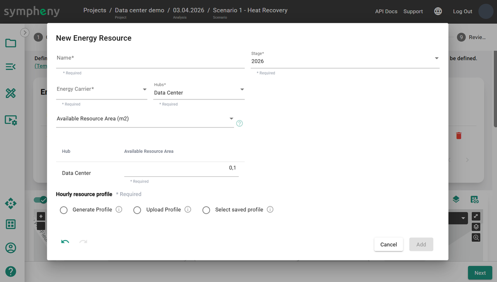
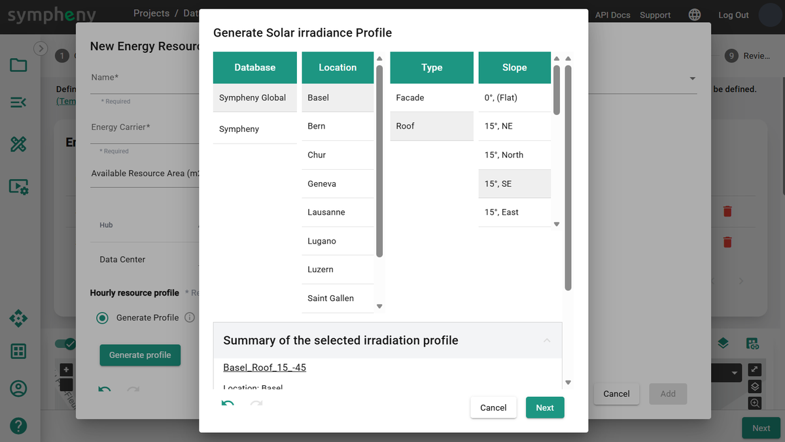
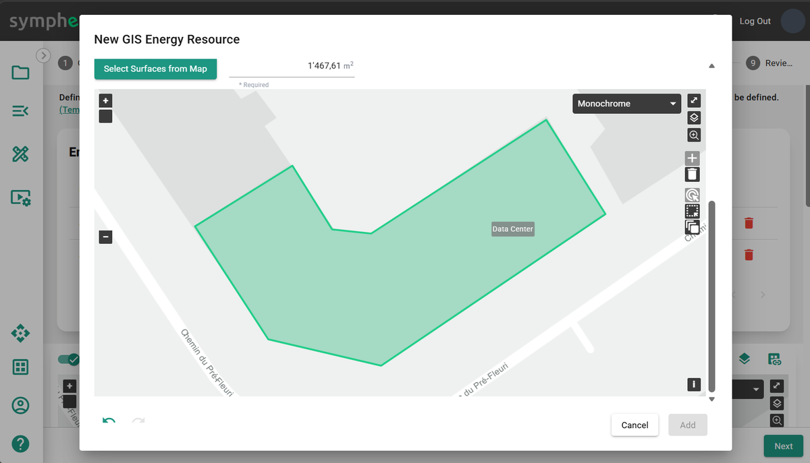
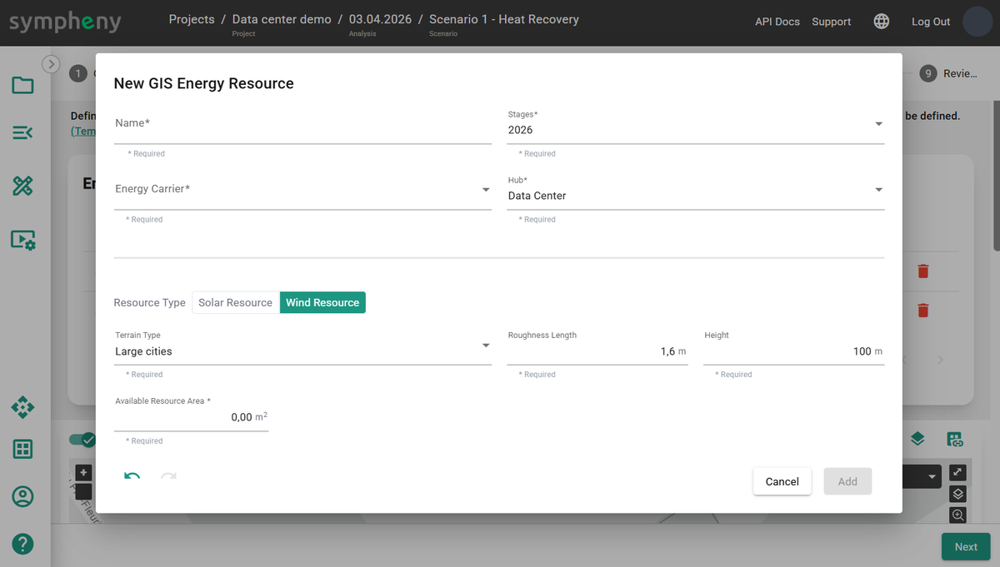

---
tags:
  - web-app
  - concepts
---

# On-site resources

On-site resources are renewable resources with intermittent (temporally varying)
availability. In Sympheny, you can quickly generate solar irradiance profiles and wind
profiles of 8,760 time steps using several methods.

On-site resources are functionally identical to imports, with fewer available
parameters. For resources with constant availability, like geothermal energy or air
used in a heat pump, create an **import** with a fixed **maximum capacity (kW)** and
without an **energy price (CHF/kWh)**, instead of creating an on-site resource.

Energy produced from on-site resources can be curtailed. Curtailment occurs when the
available on-site resource leads to higher energy production than required by demand
and export (see the diagram below) at any given time.

## Creating on-site resources

Sympheny offers several workflows for creating on-site resources:

- **Add new > Generate profile > Available resource area (m2)** — generate a solar
  profile using the Sympheny database; easy to create profiles for multiple hubs.
- **Add new > Upload profile > Available peak load (kWp)** — upload your own normalized
  profile; easy to create profiles for multiple hubs.
- **Add new > Upload profile > Generic availability (kWh/h)** — upload your own
  profile.
- **Add from map > Solar resource > Optimize slope and azimuth** — explore the optimal
  orientation of solar panels relative to the demand profile.
- **Add from map > Solar resource > Custom slope and azimuth** — accurately estimate
  the solar profile for a specific location, surface, and orientation.
- **Add from map > Solar resource > Weighted sum aggregation** — generate an average
  solar profile from multiple surfaces on the map.
- **Add from map > Wind resource** — generate a wind power production profile using
  terrain parameters.

## Add new

Add a new on-site resource to your scenario. This resource is free and can be exploited
whenever it is available. In the toolbox, select an **energy carrier** corresponding to
the resource type. A **name** is generated based on the energy carrier and existing
profiles, and can be edited. The **hub** and **stage** where the resource is available
are selected automatically and can be edited.

## Available resource area (m2)

When sizing a new solar PV field, the only available information may be the available
resource area (m2) and the location. Select **Generate profile**, click
**Generate profile**, then select the **database**, **location**, **type**, and
**slope**, and click Next. Sympheny generates a solar irradiance profile for a 1 m2
surface area.

The available resource area (m2) is the maximum available irradiance profile. The
optimization result determines the optimal size of the solar technology to install. As
curtailment may happen, the installed capacity is not always equal to the maximal
operational capacity.

## Available peak load (kWp)

When the hourly profile is measured or simulated using a third-party tool, you can use
it in Sympheny with the **Upload profile** function. In this workflow, the maximum
value of the uploaded profile should equal 1 kW. The total energy available depends on
the **available peak load (kWp)**. The profile can be the output of the technology
(for example, PV production or wind turbine production), provided the technology's
efficiency is 100%. In that case, the kW-peak (kWp) refers to the maximum capacity of
the technology that uses this on-site resource.

!!! tip
    To upload a profile, select or drag and drop an .xlsx file with the correct format.
    The file must consist of a single sheet with 2 columns, no header, and exactly
    8,760 rows. The first column must contain incrementing numbers from 1 to 8,760. The
    second column must contain the values for the hourly profile, for every hour of
    the year from 00:00 on January 1st to 23:00 on December 31st. Make sure the units
    are correct. The maximum file size is 2 MB. Uploaded profiles can be saved for
    later use.
    [Download the template profile (XLSX)](https://prod-eu-north-1-sympheny-public.s3.eu-north-1.amazonaws.com/docs/templates/example-energy-demand-profile.xlsx)

For example, the hourly resource profile of **wind power** indicates the availability
of wind-sourced electricity in kW per unit of peak load (kW/kWp). In this case, a
conversion efficiency is already factored into the hourly resource profile, so the
conversion efficiency of the wind turbine technology should be 100%.

The use of the on-site resource is determined by the optimal capacity of the
technologies that utilize that resource.

## Generic availability (kWh/h)

This workflow is more flexible than the previous two. For example, you can use it to
create an intermittent industrial waste heat profile. In this workflow, the uploaded
profile should be in kWh for each hour of the year.

!!! tip
    You can download irradiation profiles from external databases such as
    [PVGIS](https://re.jrc.ec.europa.eu/pvg_tools/en/#MR) — just make sure the units
    are consistent with the Sympheny workflow.

## Add from map

Add a new on-site resource to your scenario from the map.

## Solar resource > Optimize slope and azimuth

Click **Select surface from map** to select a surface, like the outline of a hub, to
get the surface area (m2) of the geometry and its geographic location. The optimizer
defines the optimal slope and azimuth.

## Solar resource > Custom slope and azimuth

Click **Select surface from map** to select a surface, like the outline of a hub, to
get the surface area (m2) of the geometry and its geographic location. Specify the
slope and azimuth.

Possible settings:

- **Slope 0°**: flat
- **Slope 90°**: vertical
- **Azimuth 0°**: south
- **Azimuth -90°**: east
- **Azimuth 90°**: west
- **Azimuth 180° / -180°**: north

## Solar resource > Weighted sum aggregation

Calculate an aggregated solar profile, normalized in kW/m2, for all selected surfaces.
The calculation accounts for the slope and azimuth of each roof element. The generated
profiles are aggregated using a weighted average for each surface, with surface areas
as weights.

## Wind resource

Set **surface (m2)**, **terrain type**, **roughness length (m)**, and **height (m)** to
generate a wind resource profile based on those parameters.

- **Surface (m2)** should be the number of wind turbines multiplied by the total swept
  area per turbine.
- **Terrain type** determines the terrain classification.
- **Roughness length (m)** is based on the terrain type.
- **Height (m)** is the height of the middle of the turbine.

The maximum theoretical efficiency of the wind turbine technology, using this resource
profile in kWh-wind, is 59.3%. For more information, see
[Wind profile power law](https://en.wikipedia.org/wiki/Wind_profile_power_law).

