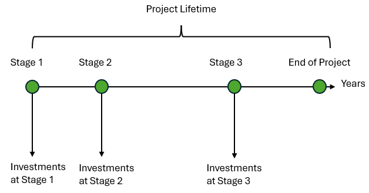

---
tags:
  - web-app
  - concepts
---

# Stages

Technologies go through stages for installation, use, and potential reuse. Each stage
has its own associated costs and demands. You define which stages each technology can
be in. Technologies can be installed at the start of a stage and reused or salvaged at
its end. The design and operation stay the same within a stage, which lets you optimize
long-term projects with multiple phases of investment. For parameters, see
[Stages parameters](parameters/stages.md).

!!! note
    Sympheny uses discounted cash flow (DCF) analysis to convert the total cost
    (represented by the net present cost, NPC) into an annual cost. See
    [Discounted cash flow analysis](discounted-cash-flow-analysis.md) for details.
