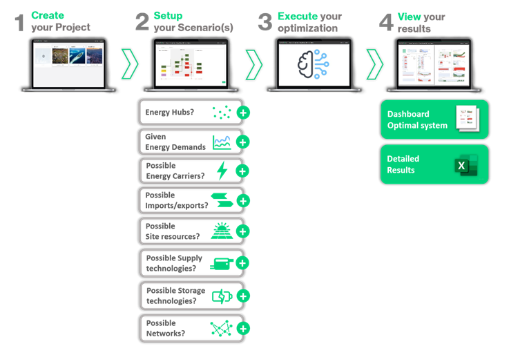

---
tags:
  - web-app
  - getting-started
---

# Getting started

## What is Sympheny?

Sympheny is a toolset for integrated energy system planning, suitable for scales ranging from buildings to cities. You can model energy systems with basic site details, quickly evaluate various supply options, and identify the most suitable ones. Its dashboards provide in-depth insights into the technology and performance of each solution. You can also run multiple scenarios simultaneously to understand the impact of factors like energy prices and site configurations.

## What makes it unique?

Sympheny provides the data and the flexibility needed to quickly simulate scenarios that fit virtually any energy concept. Detailed results help identify optimal energy supply solutions with precision. Advanced optimization algorithms analyze thousands of potential solutions, pinpointing the best options based on the planner's objectives. These algorithms solve energy balances for every hour of the year, considering complex site-specific supply and demand dynamics, interactions between various energy vectors, and the detailed techno-economic specifications of available technologies.

## What can Sympheny be used for?

The Sympheny web app can be used to identify the optimal energy supply solution for a given site or to assess the expected performance of user-defined supply solutions. You can use it to:

- **Optimize production technologies:** Determine the most suitable energy production technologies for a site, how they should be dimensioned, and whether to use a centralized, decentralized, or hybrid solution for heating and/or cooling.
- **Optimize renewables integration:** Assess the potential to cover on-site energy demands with on-site renewable energy sources (e.g., solar, groundwater heat) and identify the optimal mix of renewable resources and technologies for a site.
- **Optimize energy storage:** Identify the most suitable storage technologies for a site, evaluate the cost-effectiveness of batteries, and consider options for seasonal (e.g., geothermal) and hydrogen storage.
- **Optimize thermal networks:** Determine if a thermal network is viable, identify the most efficient network type (e.g., low-temperature, high-temperature), decide which buildings or sectors to connect, and choose the appropriate production technologies for heating or cooling the network.
- **Optimize grid interactions:** Decide which energy vectors to import based on cost and CO2 intensity, evaluate the possibility of operating the site autonomously from the electricity grid, and analyze peak electricity withdrawals and feed-ins.

Sympheny allows for the combination of these optimizations and more, providing a comprehensive tool for energy system planning.

## What can't Sympheny be used for?

- Building-level high-resolution optimization of sites larger than 15-20 buildings. Larger sites may require aggregation of buildings into nodes/hubs.
- Detailed hydraulic optimization of thermal networks or detailed optimization of electrical networks.
- Optimizing the control or operational management of energy systems.
- Sympheny is best suited for engineering problems in early phases of planning (SIA 1 and 2), but it can still be used as a digital twin, carried over to later planning stages.

## Where should I start?

The recommended starting point is the Example case, which is installed in every user's account upon first sign-in. Work through these three pages in order to sign in, learn how the app is organized, and see what it can do:

1. [Sign up and log in](sign-up-and-log-in.md): create your account and sign in for the first time.
2. [Structure](structure.md): how projects, analyses, scenarios, executions, and solutions relate to each other.
3. [Quick start](quick-start.md): a guided walkthrough of the Example case, from opening the project to reading the results.

## Ready to build your own model?

The [Step-by-step guide](../step-by-step-guide/index.md) takes you through the whole modeling process: creating a project and an analysis, working through the eight scenario steps, running the optimization, and exploring the results in the dashboard.

## What if I run into problems?

Check the [FAQs](../support/faqs.md) for answers to common questions, or [contact support](../support/index.md) to reach us directly.
