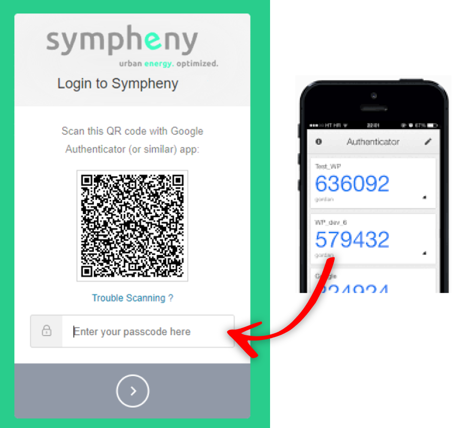

---
tags:
  - web-app
  - getting-started
---

# Sign up and log in

## Sign up

Upon signing up, you'll receive a confirmation email with a verification link. Click the link, set your password, and then log in to Sympheny.

## Log in

When you log in for the first time, you'll need to accept Sympheny's General Terms and Conditions. It's mandatory to accept these terms to use the web app.

## Log in with MFA (multi-factor authentication)

For added security, you can enable multi-factor authentication (MFA) to log in to your Sympheny account:

1. Enter your email and password as usual.
2. Scan the QR code using an authenticator app on your phone.
3. Enter the code provided by the authenticator app to complete the login process.

If you'd like to enable MFA or have any questions, feel free to contact us for assistance.

## What's next?

Once you're signed in, follow the [quick start walkthrough](quickstart.md) to build your first scenario, or explore [web app usage](../how-to/index.md) for more detailed instructions.
