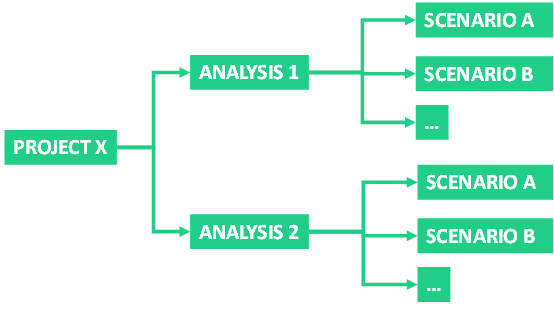

---
tags:
  - web-app
  - getting-started
---

# Structure

The Sympheny web app organizes your work into three levels: projects contain analyses, and analyses contain scenarios. All modeling takes place within a scenario. Running a scenario creates an execution and one or more solutions.

## Structure overview

- **[Projects](../step-by-step-guide/projects.md)**: individual sites or areas to be optimized.
- **[Analyses](../step-by-step-guide/analyses.md)**: groups of related scenarios within a project, such as design iterations or distinct project stages.
- **[Scenarios](../step-by-step-guide/index.md)**: complete descriptions of an energy system, including every input the optimization uses.
- **[Executions](../step-by-step-guide/execution.md)**: saved optimization runs, together with copies of the corresponding scenario parameters.
- **[Solutions](../step-by-step-guide/results-dashboard.md)**: outcomes of an execution. A multi-objective execution returns several, each a different trade-off you can compare in the interactive dashboard.

## What's next?

- [Quick start](quick-start.md): see how these pieces fit together in practice, by walking through the Example case that comes with your account.
- [Step-by-step guide](../step-by-step-guide/index.md): build a model of your own site, from creating a project and an analysis, through the eight scenario steps, to running the optimization and exploring the results.
