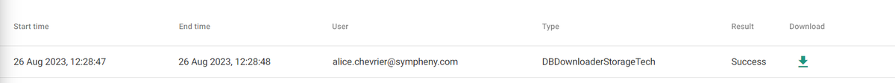

---
tags:
  - web-app
  - how-to
---

# Download databases

Downloading your database is useful when you want an overview of all your data, or need to do some post-processing or adjusting.

## Steps

To download your data:

1. Navigate to the database and the type of data you want to download (for example, Energy Demands, On-site Resources, or a category of Technologies).
2. On the right side of your screen, click the **Download** button.
3. Scroll to the bottom of the page and click the download arrow.
4. Open the downloaded file in Excel.

!!! tip
    The format of the downloaded Excel file matches the format required for uploading databases.

