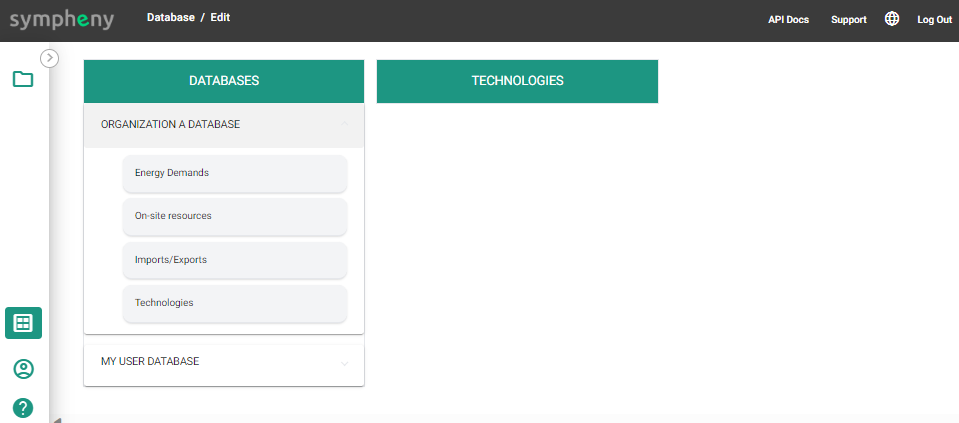

---
tags:
  - web-app
  - how-to
---

# Database Center

The Database Center gives you an overview of all your data. Saved data can be called from the scenario editor across all scenarios. Through the Database Center, you can also [download databases](download-databases.md) or [upload databases](upload-databases.md) to the web app from other sources.

## Overview of the databases

In the Sympheny Database Center (the database icon at the bottom left of your screen), you have access to up to two databases:

- **My User Database**: your own private database, available to you across all your scenarios. You can maintain this database directly.
- **Organization Database**: the database specific to your organization, named after your organization. Only accounts from your organization can access this data — see the roles and permissions table below.

## Roles & permissions

The account type and license determine which rights are available to which users.

| Access | Organization Database | My User Database |
| --- | --- | --- |
| Download | Organization users | Individual user |
| Upload / Delete | Organization admin users | Individual user |
