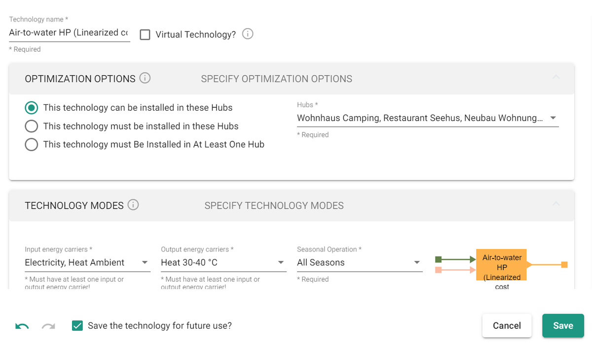
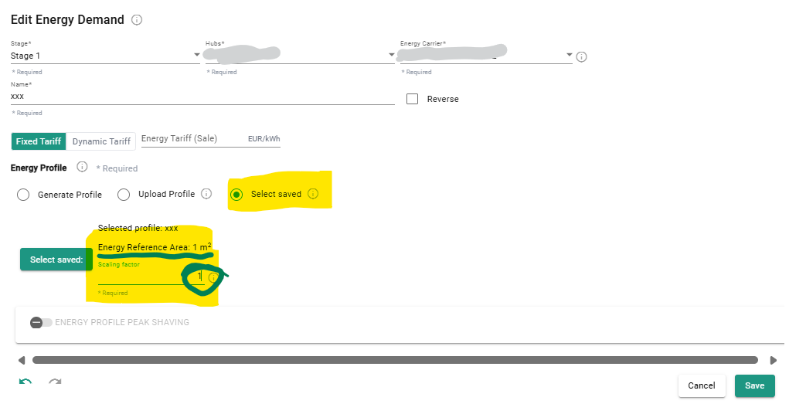
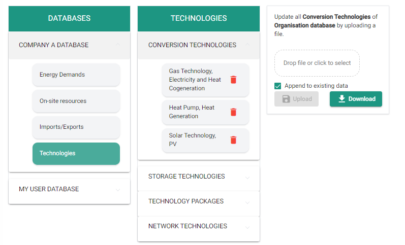
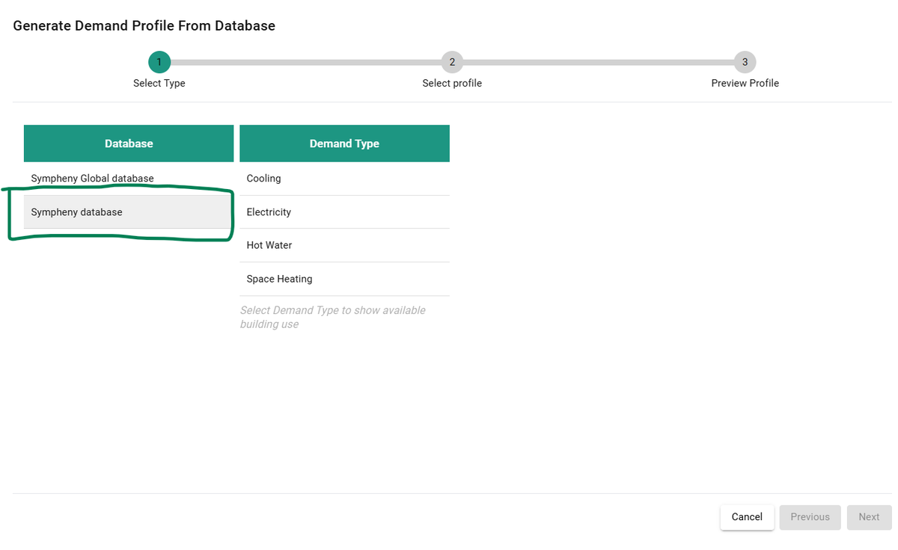

---
tags:
  - web-app
  - how-to
---

# Upload databases

## Direct upload from Scenario Editor

### Conversion and storage technologies

While editing a scenario, you can upload single items to My User Database directly from the scenario editor (in Setup) by checking **Save the technology for future use?**.

### Energy demand profiles

This process is streamlined:

1. In the [Excel template](https://prod-eu-north-1-sympheny-public.s3.eu-north-1.amazonaws.com/docs/templates/energy-demands-user-db-template.xlsx), enter profile names in Sheet 1.
2. In Sheet 2, add the corresponding profile under the columns with the same column names as in Sheet 1.

#### Use demand profiles from My User Database

To use the data, click **Select Saved** when adding a new demand in step 4.

## Upload from Database Center

To upload data to your databases, first prepare your data in the correct format. The parameters available depend on the type of data you want to upload. The databases you're allowed to modify depend on your [roles and permissions](index.md#roles-permissions) within your organization.

### Conversion and storage technologies

1. Select the database (My User Database or Organization Database) you want to add or replace data for.
2. Select the type of data (Energy Demands, On-site Resources, or a category of Technology).
3. Drop or select your file, then click upload.

By default, uploaded data is added to the existing database. To add new data without replacing the current content, keep **Append existing data** checked. To replace the entire database with the new data, uncheck **Append existing data** — this overwrites the existing database entirely.

### Energy carriers naming conventions

Energy carriers (EC) must follow the exact nomenclature given in the table below.

After adding a specific technology from the scenario editor, you can change the energy carriers to any other EC available in that scenario.

| Energy carrier name | Nomenclature for templates |
| --- | --- |
| Cooling -20 - -10°C | COOLING_1 |
| Cooling -10 - 0°C | COOLING_2 |
| Cooling 0 - 10°C | COOLING_3 |
| Cooling 10 - 20°C | COOLING_4 |
| Ice | ICE |
| Electricity | ELECTRICITY |
| Electricity Renewable | ELECTRICITY_RENEWABLE |
| Biogas | BIOGAS |
| Gas | GAS |
| Hydrogen | HYDROGEN |
| Hydrogen Pressurized | HYDROGEN_PRESSURIZED |
| Oil | OIL |
| Coal | COAL |
| Wood Chips | WOOD_CHIPS |
| Wood Pellets | WOOD_PELLETS |
| Heat 0-10 °C | HEAT_1 |
| Heat 10-20 °C | HEAT_2 |
| Heat 20-30 °C | HEAT_3 |
| Heat 30-40 °C | HEAT_4 |
| Heat 40-50 °C | HEAT_5 |
| Heat 50-60 °C | HEAT_6 |
| Heat 60-70 °C | HEAT_7 |
| Heat 70-80 °C | HEAT_8 |
| Heat 80-90 °C | HEAT_9 |
| Heat Ambient | HEAT_AMBIENT |
| Steam Low Pressure | STEAM_LOW_PRESSURE |
| Biomass | BIOMASS |
| Geothermal | GEOTHERMAL |
| Hydro | HYDRO |
| Process Waste Heat | PROCESS_WASTE_HEAT |
| Solar Facade | SOLAR_FACADE |
| Solar Parapet | SOLAR_PARAPET |
| Solar Roof | SOLAR_ROOF |
| Tidal | TIDAL |
| Wind | WIND |

### Energy demands: usage and naming convention

To upload energy demand profiles, fill in an Excel file with two sheets. There are currently two cases, depending on whether you're uploading to My User Database (see "Use demand profiles from My User Database" above) or to your Organization Database.

#### Upload to Organization Database

This method is preferred for batch upload.

1. In the [Excel template](https://prod-eu-north-1-sympheny-public.s3.eu-north-1.amazonaws.com/docs/templates/energy-demands-org-db-template.xlsx), enter information about each profile in Sheet 1: Building Use, Demand Type, Building Age or Standard, and Specific Energy Demand. Follow the [naming convention](#naming-convention) below. The Specific Energy Demand (kWh/m²/a) for each combination of Building Use, Demand Type, and Building Age or Standard lets you scale the profiles to each scenario's requirements via the scenario editor.
2. In Sheet 2, add the corresponding profiles under the columns with the same column names as in Sheet 1, normalized to 1 kWh. Make sure the naming in row 1 of Sheet 2 matches the naming in column A of Sheet 1.

##### Naming convention

Upload your demands under one of the four demand types listed below, using this nomenclature:

| Demand names | Demand types |
| --- | --- |
| Electricity | ELECTRICITY |
| Space Heating | SPACE_HEATING |
| Hot Water | HOT_WATER |
| Cooling | COOLING |

Building use type must be one of the following:

| Building use types |
| --- |
| RESIDENCE_MFH |
| RESIDENCE_SFH |
| ADMINISTRATION |
| OFFICES |
| SCHOOLS |
| RETAIL |
| RESTAURANT |
| ASSEMBLY |
| HOSPITALS |
| INDUSTRY |
| WAREHOUSE |
| SPORTS_CENTER |
| INDOOR_POOL |
| HOTEL |

Building age or standard must use the following nomenclature:

| Building age or standard |
| --- |
| OTHERS |
| SIA_2024_EXISTING_MFH |
| SIA_2024_STANDARD_MFH |
| SIA_2024_TARGET_MFH |
| SIA_2024_EXISTING_SFH |
| SIA_2024_STANDARD_SFH |
| SIA_2024_TARGET_SFH |
| SIA_2024_STANDARD_INDOOR_SWIMMING_POOL |
| SIA_2024_TARGET_INDOOR_SWIMMING_POOL |
| SIA_2024_EXISTING_SINGLE_GROUP_OFFICE |
| SIA_2024_STANDARD_SINGLE_GROUP_OFFICE |
| SIA_2024_TARGET_SINGLE_GROUP_OFFICE |
| SIA_2024_EXISTING_OPEN_PLAN_OFFICE |
| SIA_2024_STANDARD_OPEN_PLAN_OFFICE |
| SIA_2024_TARGET_OPEN_PLAN_OFFICE |
| SIA_2024_EXISTING_MEETING_ROOM |
| SIA_2024_STANDARD_MEETING_ROOM |
| SIA_2024_TARGET_MEETING_ROOM |
| SIA_2024_EXISTING_COUNTER_HALL |
| SIA_2024_STANDARD_COUNTER_HALL |
| SIA_2024_TARGET_COUNTER_HALL |
| SIA_2024_EXISTING_CLASS_ROOM |
| SIA_2024_STANDARD_CLASS_ROOM |
| SIA_2024_TARGET_CLASS_ROOM |
| SIA_2024_EXISTING_TEACHERS_LOUNGE |
| SIA_2024_STANDARD_TEACHERS_LOUNGE |
| SIA_2024_TARGET_TEACHERS_LOUNGE |
| SIA_2024_EXISTING_LIBRARY |
| SIA_2024_STANDARD_LIBRARY |
| SIA_2024_TARGET_LIBRARY |
| SIA_2024_EXISTING_AUDITORIUM |
| SIA_2024_STANDARD_AUDITORIUM |
| SIA_2024_TARGET_AUDITORIUM |
| SIA_2024_EXISTING_SCHOOL_SUBJECT_ROOM |
| SIA_2024_STANDARD_SCHOOL_SUBJECT_ROOM |
| SIA_2024_TARGET_SCHOOL_SUBJECT_ROOM |
| SIA_2024_EXISTING_FOOD_SALE_STORE |
| SIA_2024_STANDARD_FOOD_SALE_STORE |
| SIA_2024_TARGET_FOOD_SALE_STORE |
| SIA_2024_EXISTING_SPECIALTY_STORE |
| SIA_2024_STANDARD_SPECIALTY_STORE |
| SIA_2024_TARGET_SPECIALTY_STORE |
| SIA_2024_EXISTING_SALES_FURNITURE_DIY_GARDEN |
| SIA_2024_STANDARD_SALES_FURNITURE_DIY_GARDEN |
| SIA_2024_TARGET_SALES_FURNITURE_DIY_GARDEN |
| SIA_2024_EXISTING_PATIENT_ROOM |
| SIA_2024_STANDARD_PATIENT_ROOM |
| SIA_2024_TARGET_PATIENT_ROOM |
| SIA_2024_EXISTING_WARD_ROOM |
| SIA_2024_STANDARD_WARD_ROOM |
| SIA_2024_TARGET_WARD_ROOM |
| SIA_2024_EXISTING_TREATMENT_ROOM |
| SIA_2024_STANDARD_TREATMENT_ROOM |
| SIA_2024_TARGET_TREATMENT_ROOM |
| MINERGIE_NEW_CONSTRUCTION |
| MINERGIE_P_NEW_CONSTRUCTION |
| MINERGIE_P_RENOVATION |
| MINERGIE_RENOVATION |
| SIA_2024_EXISTING_GYMNASIUM |
| SIA_2024_STANDARD_GYMNASIUM |
| SIA_2024_TARGET_GYMNASIUM |
| SIA_2024_EXISTING_FITNESS_ROOM |
| SIA_2024_STANDARD_FITNESS_ROOM |
| SIA_2024_TARGET_FITNESS_ROOM |
| SIA_2024_EXISTING_INDOOR_SWIMMING_POOL |
| SIA_2024_EXISTING_HOTEL_ROOM |
| SIA_2024_STANDARD_HOTEL_ROOM |
| SIA_2024_TARGET_HOTEL_ROOM |
| SIA_2024_EXISTING_WAREHOUSE |
| SIA_2024_STANDARD_WAREHOUSE |
| SIA_2024_TARGET_WAREHOUSE |
| SIA_2024_EXISTING_LOBBY |
| SIA_2024_STANDARD_LOBBY |
| SIA_2024_TARGET_LOBBY |
| AGE_1970_1980 |
| AGE_1980_1995 |
| AGE_1995_2005 |
| AGE_2005_2015 |
| AGE_UNDER_1970 |
| AGE_OVER_2015 |
| MINERGIE_A |

#### Use demand profiles from My User Database

To use your profile, click **Generate Profile** when adding a new demand in step 4, then click your organization database (in this example, "Sympheny database"):

### Currency

The cost database is maintained in CHF.

#### Through the scenario editor

When you save a technology to the database while working in another currency (for example, EUR), the data is converted to CHF using the exchange rate in the scenario. When that database entry is used again in the future, it's converted from CHF back to the current EUR value using the exchange rate of the new scenario.

For example, working with EUR and an exchange rate of 1.1 (1 CHF = 1.1 EUR):

- You save a technology from the scenario editor with a value of 1,100 EUR.
- In the database, this technology is saved as 1,100 EUR × (1 / 1.1) CHF/EUR = 1,000 CHF.
- In a later scenario with an exchange rate of 1.2 (1 CHF = 1.2 EUR), this technology, when selected from the database, is entered as 1,000 CHF × 1.2 = 1,200 EUR.

#### Through the upload from Database Center

When you upload data through the Excel upload, the data is in CHF.

## Templates

Download the templates for the upload here:

### Conversion technologies

[Conversion technologies template (XLSX)](https://prod-eu-north-1-sympheny-public.s3.eu-north-1.amazonaws.com/docs/templates/conversion-technologies-template.xlsx)

Last updated: 2024-11-04

### Storage technologies

[Storage technologies template (XLSX)](https://prod-eu-north-1-sympheny-public.s3.eu-north-1.amazonaws.com/docs/templates/storage-technologies-template.xlsx)

Last updated: 2024-11-04

### Network technologies

[Network technologies template (XLSX)](https://prod-eu-north-1-sympheny-public.s3.eu-north-1.amazonaws.com/docs/templates/network-technologies-template.xlsx)

Last updated: 2024-11-04

### Energy demands

#### My User Database

[Energy demands template — My User Database (XLSX)](https://prod-eu-north-1-sympheny-public.s3.eu-north-1.amazonaws.com/docs/templates/energy-demands-user-db-template.xlsx)

Last updated: 2024-11-04

#### Organization Database

[Energy demands template — Organization Database (XLSX)](https://prod-eu-north-1-sympheny-public.s3.eu-north-1.amazonaws.com/docs/templates/energy-demands-org-db-template.xlsx)

Last updated: 2024-11-04
