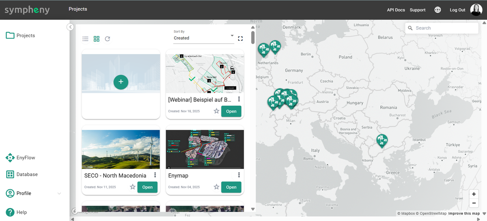
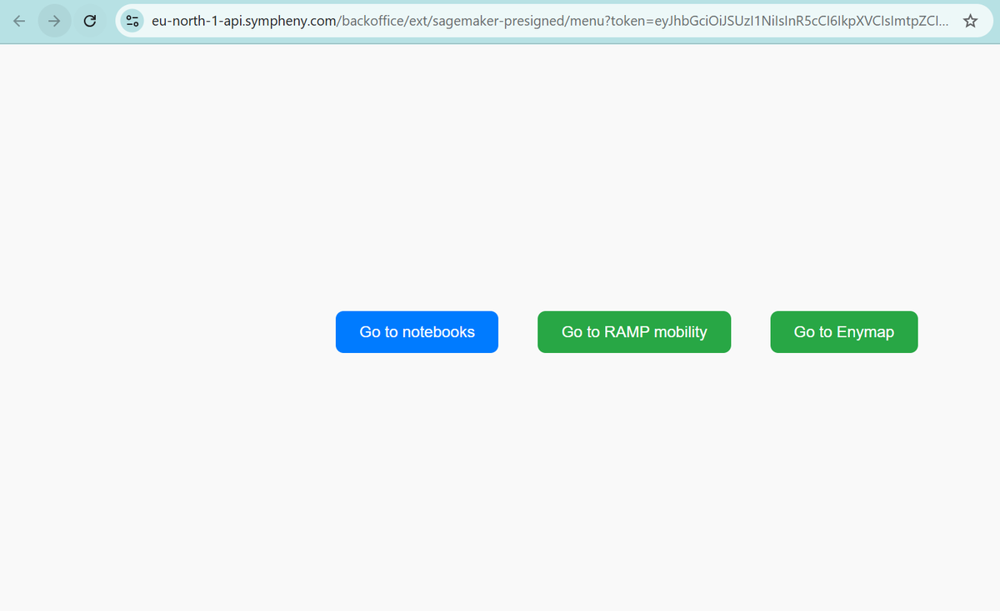
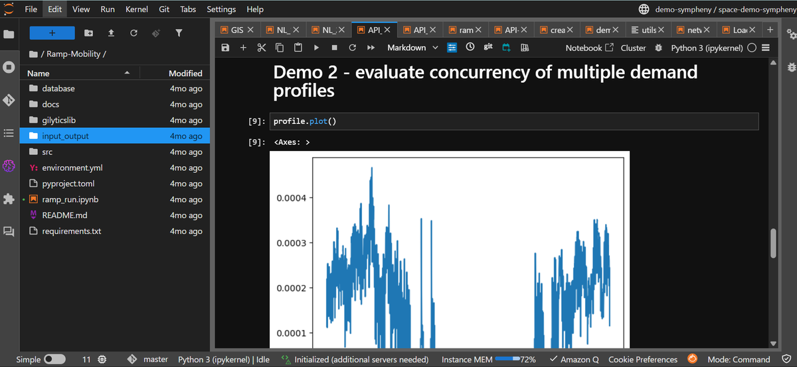

---
tags:
  - web-app
  - how-to
---

# Sympheny EnyFlow

Sympheny EnyFlow is a Jupyter Notebook environment that combines energy
planning, advanced problem-solving, and visualization while directly leveraging
the Sympheny web application and its API. You work in notebooks — in Google
Colab or in the Sympheny EnyFlow Jupyter framework — and call Sympheny to load
projects, run optimizations, and retrieve results.

EnyFlow lets you:

- Connect to Sympheny via the API.
- Build custom workflows and analyses in notebooks.
- Automate and document advanced planning and optimization tasks.
- Visualize and share results interactively.

## Key features and advantages

**Advanced problem solving.** Combine Sympheny's optimization with your own
models to analyze multi-energy systems, optimize resource allocation and
operation, evaluate renewable-integration strategies, and design and assess
sustainable energy scenarios.

**Data visualization.** Create interactive charts, tables, maps, and dashboards
to explore energy data, interpret optimization results, and communicate findings
to stakeholders.

**Customized workflow integration.** Bring your own algorithms, models,
simulation tools, data-processing pipelines, and optimization routines into the
same notebook, alongside calls to the Sympheny API — adapting EnyFlow to your
use cases while keeping your existing intellectual property.

**Comprehensive energy planning support.** Support a broad range of tasks, such
as load and demand forecasting, demand-response and flexibility analysis,
renewable-integration studies, infrastructure and network planning, and scenario
comparison and sensitivity analysis.

**Collaboration and reproducibility.** Because EnyFlow is notebook-based, each
analysis is documented as code, text, and results together. Share notebooks with
your team via Git, shared drives, or Colab links, and reproduce results reliably
by rerunning a notebook with the same inputs.

**Efficiency and scalability.** Run EnyFlow locally or in the cloud (for example
via the Sympheny interface in SageMaker, via Colab, or another Jupyter service)
to scale up to larger problems and use more powerful hardware.

## Using the Sympheny API with EnyFlow

Whether you work in Google Colab or in the Sympheny EnyFlow Jupyter framework,
the general pattern is the same:

1. Get your Sympheny API credentials — see
   [Authentication](../../../api/authentication.md) for the token flow.
2. Configure your notebook (Colab or Jupyter).
3. Call the Sympheny API to load projects, run optimizations, and retrieve
   results.
4. Analyze and visualize the results using EnyFlow tools.

For the full list of endpoints, request and response shapes, and examples, see
the [REST API reference](../../../api/index.md). If you prefer typed Python over
raw HTTP calls, the [Python SDK](../../../sdk/index.md) wraps the same API and
works well inside a notebook.
