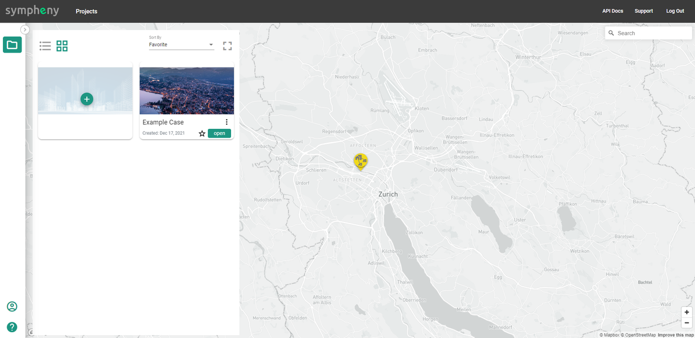

---
tags:
  - web-app
  - how-to
---

# Managing projects

This guide shows you how to create, edit, copy, share, delete, and manage your projects in Sympheny.

## Navigate your projects page

When you log in, you land on your Projects page. This page shows a geolocation view of all your existing projects. A sample project named "Example Case" is available to demonstrate project functionality.

## Create a new project

1. Click the **Add project**  button.
2. Assign a name and geolocation for your project.
3. Click **Save**.

## Manage existing projects

Most project management actions start by clicking the three dots on the project you want to work with. This opens a menu with the following options:

- **Edit project**
- **Copy project**
- **Delete project**
- **Send project copy**
- **Reinitialise project**
- **Share project**

## Send a project copy

To send a project copy to another Sympheny user:

1. Choose **Send project copy** from the menu.
2. Enter the recipient's email address.
3. Click **Send** to deliver the project copy.

!!! note
    The recipient receives a copy of the project's current state. Any changes you make afterward are not reflected in their copy.

## Share a project

Sharing grants other users access to your Sympheny projects. To share a project:

1. Choose **Share project** from the menu.
2. Choose **Add secondary owner**. You can add multiple users.
3. For each user, set an access level: **Read-only** (view the project but not modify it) or **Edit** (full control).
4. A project locks after a user starts working in it. It unlocks automatically after 10 minutes of inactivity, or you can click the unlock button next to the project's name on the Analysis page.

## Reinitialize a project

This option is available only for the example projects provided by Sympheny. Click such a project, then select **Reinitialise project** to restore it to its original state.
