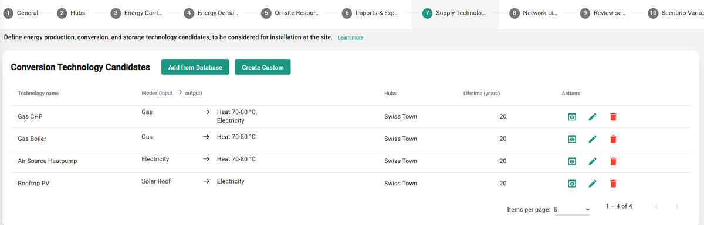

---
tags:
  - web-app
  - how-to
---

# Conversion technology step

There are two ways to add conversion technology candidates to your scenario: **Add from Database** and **Create Custom**. For more information, see [Conversion technologies](../../concepts/conversion-technologies.md).

## Add from Database

In the dialog that appears, follow these steps:

1. Select the database to load your data from. In most cases, the options are:
   1. Sympheny Global database
   2. Organization database (linked to your organization)
   3. My User database (linked to your personal account)
2. Choose a technology category.
3. Select the specific technology you want to load into your scenario. Clicking a technology displays a summary of its key parameters (see figure below).

   

4. Click **Select**. A window opens where you can view and further edit the technology model, with parameters from the database pre-filled into the corresponding fields.
5. Assign the technology to one or more hubs and stages in the **Optimization Options** section. This defines where and when the technology can be installed. Click **Add** at the bottom of the dialog to add the technology candidate to your scenario — it appears in the energy hub diagram at the bottom of the page.

   

!!! tip
    You can also build a customized technology database for the Sympheny web app. See [Database Center](../database-center/index.md).

## Create Custom

Clicking **Create Custom** opens a dialog where you assign parameters for the specific technology. It's the same window as step 4 of **Add from Database**, but the fields aren't pre-filled with any values.
