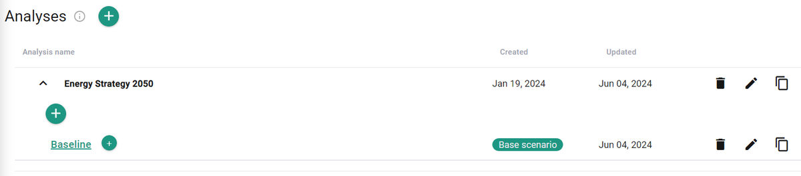

---
tags:
  - web-app
  - how-to
---

# Analyses

This guide shows you how to create and manage analyses, which can be used to organize scenarios by design iteration or project stage.

## Create a new analysis

1. Click **Add analysis**.
2. Assign a name.
3. Click **Add**.

You can rename, copy, or delete an existing analysis at any time.

## Add scenarios to the analysis

- To create a scenario, click **Add scenario** and assign a name.
- You can rename, copy, or delete existing scenarios within an analysis.
- You cannot move or copy a scenario from one analysis to another.
