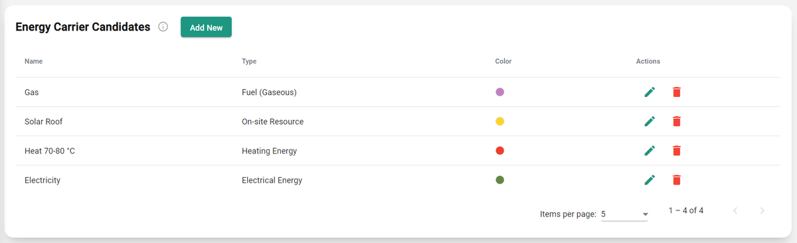

---
tags:
  - web-app
  - how-to
---

# Energy carriers step

This step lets you choose the types of energy your model considers. Each energy carrier needs a name, type, subtype, and color. For more information, see [Energy carriers](../concepts/energy-carriers.md).

!!! note
    Choosing the type and subtype doesn't affect any data directly. It only determines the default color used to represent that energy carrier in your model's visuals.

You can always return to this step to add more energy carriers later. If you try to add, for example, a supply technology that isn't in your list of energy carriers, Sympheny asks if you'd like to add the missing energy carrier to the list.
