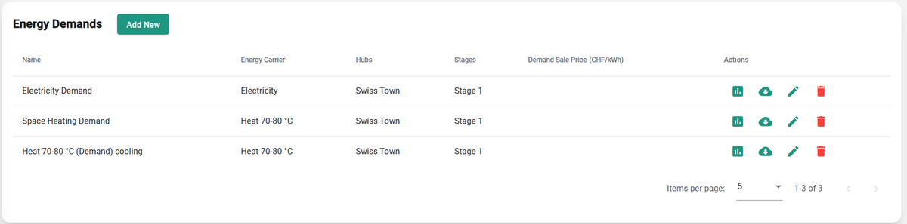
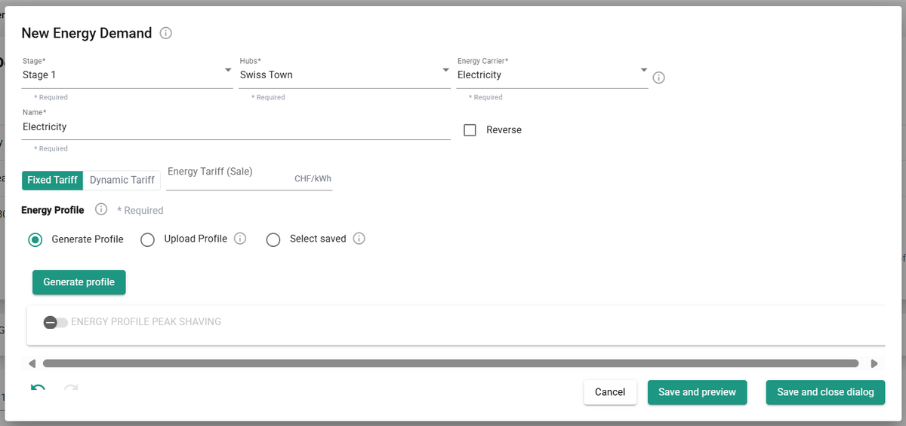
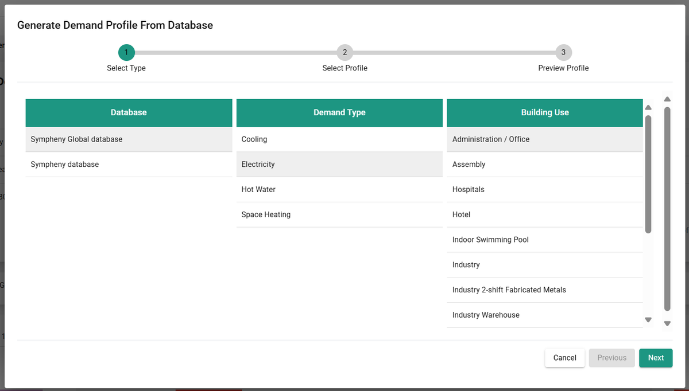
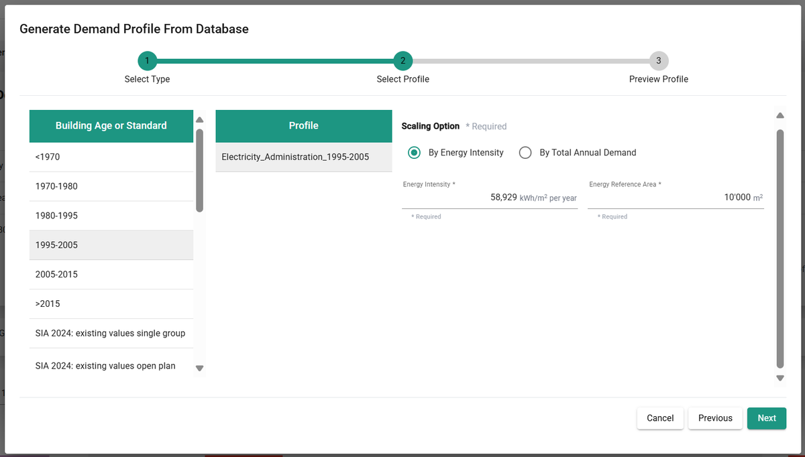
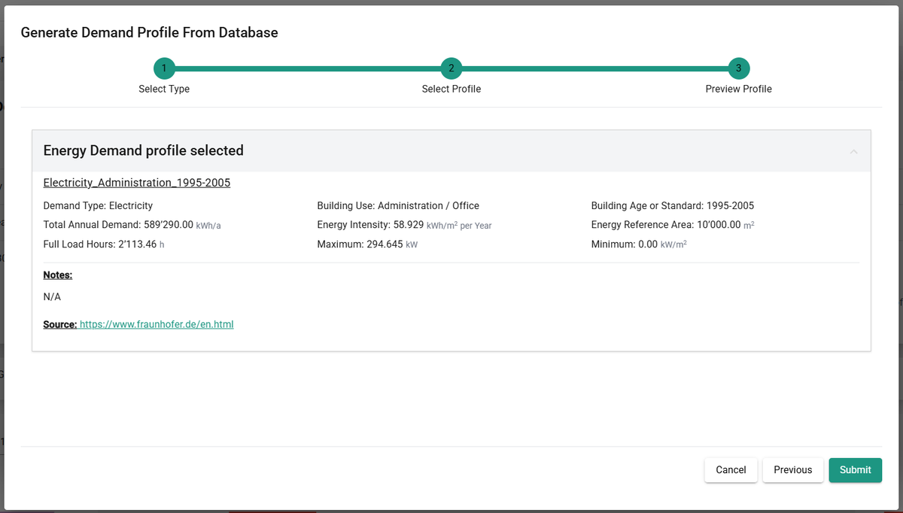
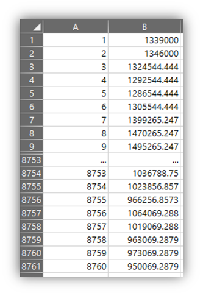
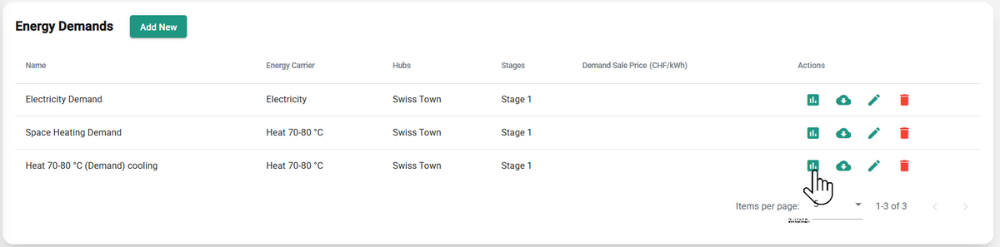
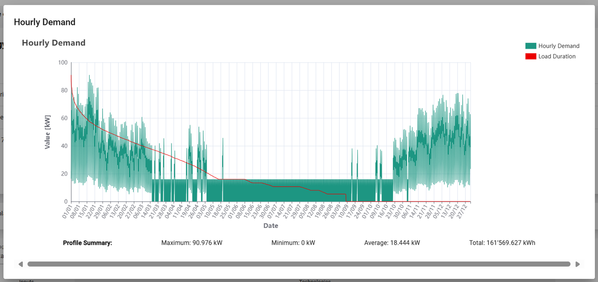

---
tags:
  - web-app
  - how-to
---

# Energy demands step

In this step, you define all energy demands included in your scenario. Each demand must have a unique name and an energy carrier, and must be linked to at least one hub and one stage. For more information, see [Energy demands](../concepts/energy-demands.md).

## Add new

You have several options for creating energy demand profiles:

- **Generate Profile**: automatically generate a profile based on building use types, standard norms, and your organization's internal database.
- **Upload Profile**: upload a custom profile file directly.
- **Select Saved**: choose an existing profile from your personal database.

!!! tip
    Integrate via the API to upload or modify multiple profiles in a single operation. If your license includes API access, contact support to get a template, code samples, and guidance.

## Generate profile

Generate standard hourly energy demand profiles for buildings of different types. After clicking **Generate Profile**, a dialog opens where you specify the parameters of the profile. The process has three steps:

1. **Database**: select the database to use, either Sympheny's database or your organization's database. For more information on databases, see [Database Center](../advanced-workflows/database-center.md).
2. **Profile type**: select a combination of demand type and building use to define the shape of the profile. This profile is normalized, meaning its total sum is 1 kWh/year.

   

3. **Energy use**: the normalized profile is multiplied by the annual energy demand in kWh/year. Enter this value directly as **Total Annual Demand**, or select a **Building Age or Standard** to get an estimated **Energy Intensity** in kWh/year/m², and specify the **Energy Reference Area** in m².

   

4. **Summary**: review a statistical summary of the demand profile, including the source of the data used to generate it. For more detail on how profiles are generated and a list of available profiles, see the [demand profiles methodology](../concepts/demand-profiles-methodology.md).

## Upload profile

You can specify an energy demand profile in an XLSX file and upload it. The profile must be in kWh, for every hour of the year from January 1 to December 31. The maximum file size is 2 MB. The file must contain a single sheet with 2 columns, no header, and exactly 8760 rows. Replace any empty values with 0. The 1st column contains the index (incrementing integers from 1 to 8760); the 2nd column contains the hourly energy demand values in kWh.

Download and edit this template (or any Sympheny demand profile) to make sure your format matches: [template profile XLSX](https://prod-eu-north-1-sympheny-public.s3.eu-north-1.amazonaws.com/docs/templates/example-energy-demand-profile.xlsx)

!!! tip
    Make sure your custom profile matches a Sympheny year. A Sympheny year starts at 00:00 on a Monday, January 1, and ends at 23:00 on December 31. 2018 is a good reference year, since it starts on a Monday and isn't a leap year.

## Select saved

When you upload or generate a profile, you can save it for future use. Use **Select Saved** to load an energy profile you saved previously.

## Visualization of demand data

Once a demand is added and connected, a box representing it appears on the energy hub diagram. You can download the added demand profile as an Excel file. For each energy demand in the scenario, you can visualize hourly energy demand profiles and load duration curves.

