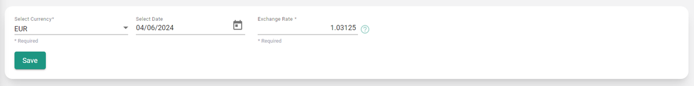
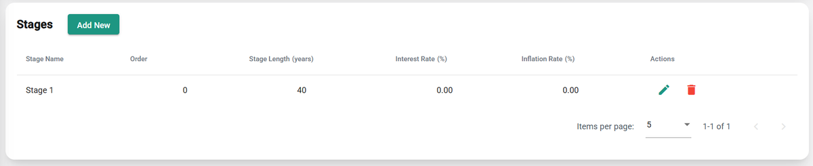

---
tags:
  - web-app
  - how-to
---

# General step

## Currency

This setting determines the currency shown in cost parameters and results. When you select a currency other than CHF, an [exchange rate](https://exchangeratesapi.io/) from CHF is applied to all economic data in the technology databases. All economic data in the databases, including user-defined data, is stored in CHF. For more information, see [General parameters](../parameters/general.md).

Economic data already included in the scenario is **not** converted; only the economic data inside databases is converted.

## Stages

Include the scenario's stages, along with their durations and economic parameters. For more information, see [Stages](../concepts/stages.md).

