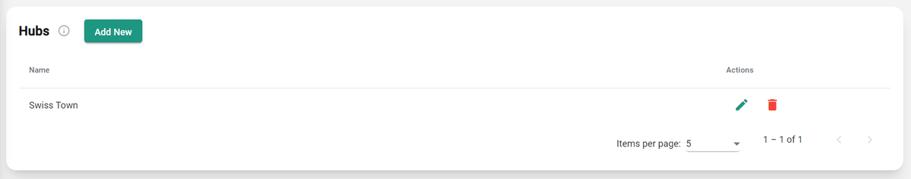

---
tags:
  - web-app
  - how-to
---

# Hubs step

In this step, you specify a list of the hubs that make up your site. Each hub must have a unique name, which identifies it in subsequent steps and in the results. For more information, see [Hubs](../concepts/hubs.md).

## Add a hub with the GIS add-on

[Watch: adding a hub with the GIS add-on](https://www.youtube.com/watch?v=w-XKBjAswL0&t=28s&ab_channel=UrbanSympheny)
