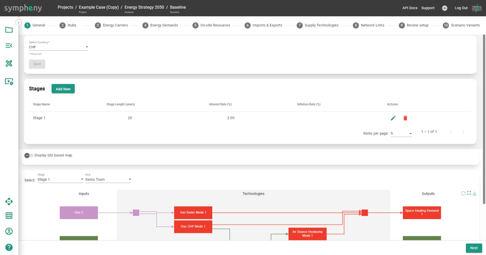
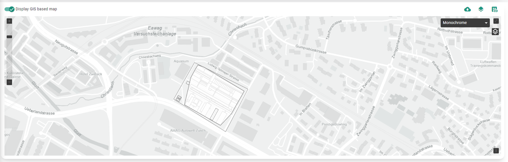
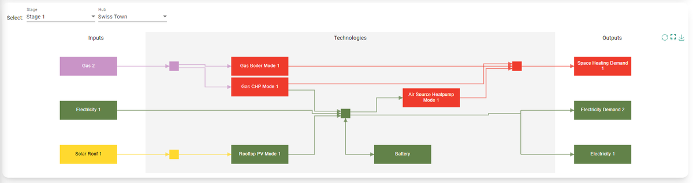

---
tags:
  - web-app
  - how-to
---

# Step-by-step guide

This guide walks you through building a Sympheny model from an empty account to an explored set of results. Work through it in order the first time; afterwards, use it to look up an individual step.

## The full sequence

1. [Projects](projects.md): create a project for the site or area you want to study.
2. [Analyses](analyses.md): create an analysis inside the project to group your scenarios.
3. Create a scenario inside the analysis, then work through the eight scenario steps below.
4. [Execution](execution.md): choose the solver parameters, run the scenario, and review previous runs.
5. [Results dashboard](results-dashboard.md): explore the solutions interactively.

## The scenario steps

Modeling a scenario is a guided process. The scenario page walks you through a series of tabs, each dedicated to a specific element of your model, so you can build your scenario step by step:

1. [General](general-step.md)
2. [Hubs](hubs-step.md)
3. [Energy carriers](energy-carriers-step.md)
4. [Energy demands](energy-demands-step.md)
5. [On-site resources](on-site-resources-step.md)
6. [Imports & exports](imports-exports-step.md)
7. [Supply technologies](supply-technologies-step.md)
8. [Network links](network-links-step.md)

## GIS map

Use the interactive GIS map to explore the hub network. After you select the hubs that interest you, the map shows GIS information for every hub, along with the buildings connected to it.

## Energy hub diagram

The energy hub diagram of your potential system appears at the bottom of each tab. It's empty when you start a new project, and updates automatically as you add components to your model. Use the drop-down menu at the top to move between the energy hub diagrams for each of your scenario's hubs and stages.

The colors of the technologies in the energy hub diagram are determined by the primary output energy carrier of the technology. You can define these colors in the [Energy carriers step](energy-carriers-step.md).

!!! tip
    The direction of the arrows in the energy hub diagram matches the direction of energy flows. A reversed energy demand (for example, a cooling demand) is shown as an arrow flowing away from the box representing that demand. Storages are the only technologies with bidirectional flows.
