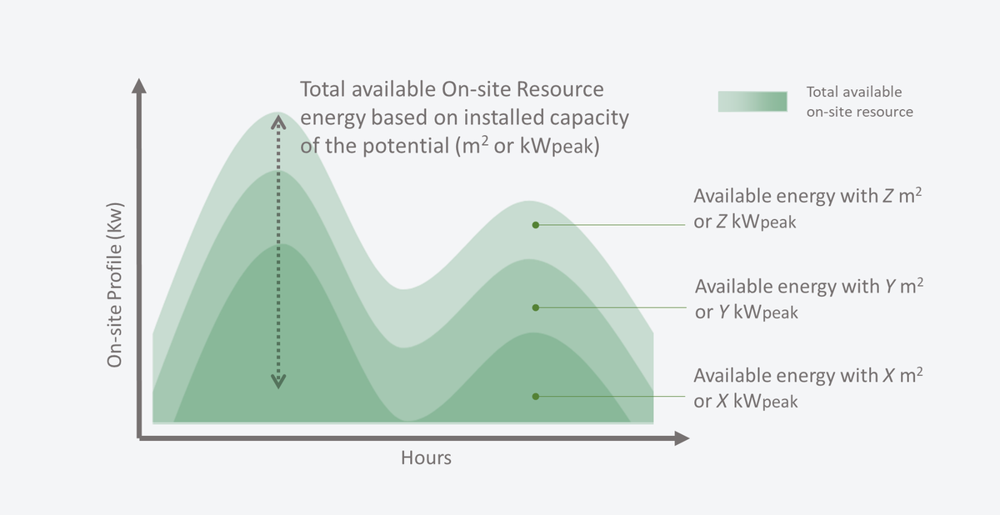
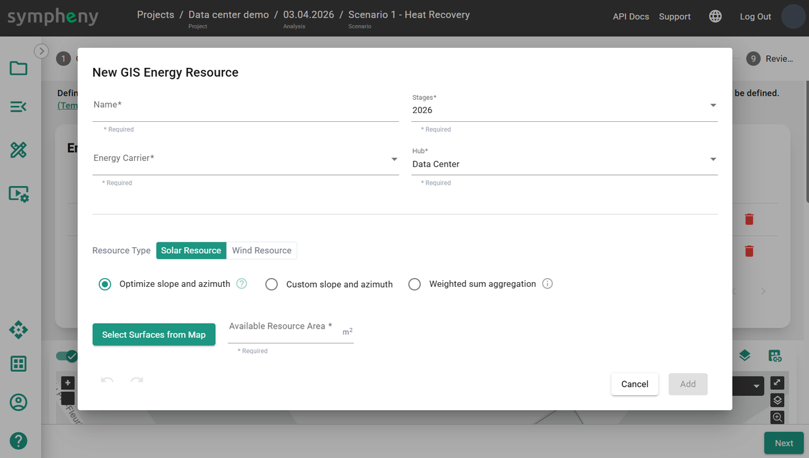
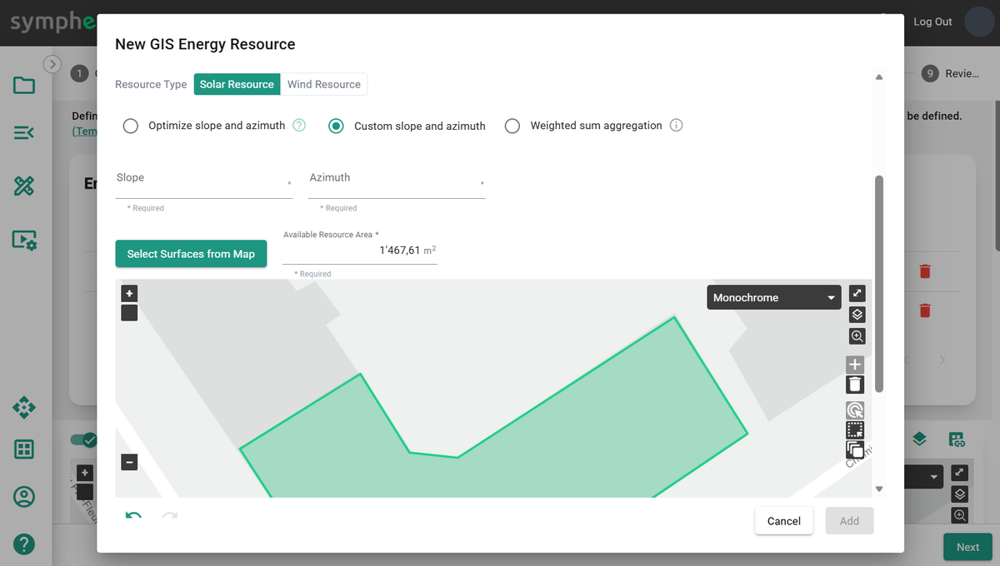

---
tags:
  - web-app
  - how-to
---

# On-site resources step

Sympheny offers several workflows to create [on-site resources](../concepts/on-site-resources.md):

- **Add new > Generate profile > Available Resource Area (m²)**: generate a solar profile using the Sympheny database. This is an easy way to create profiles across multiple hubs.
- **Add new > Upload profile > Available Peak Load (kWp)**: upload your own normalized profile. This is an easy way to create profiles across multiple hubs.
- **Add new > Upload profile > Generic Availability (kWh/h)**: upload your own profile.
- **Add from map > Solar Resource > Optimize slope and azimuth**: explore the optimal orientation of solar panels relative to the demand profile.
- **Add from map > Solar Resource > Custom slope and azimuth**: accurately estimate the solar profile for a specific location, surface, and orientation.
- **Add from map > Solar Resource > Weighted sum aggregation**: generate an average solar profile from multiple surfaces on the map.
- **Add from map > Wind Resource**: generate a wind power production profile using terrain parameters.

## Add new

Add a new on-site resource to your scenario. This resource is free and can be used whenever it's available. In the toolbox, select an **Energy Carrier** matching the resource type. A **Name** is generated based on the energy carrier and existing profiles, and can be edited. The **Hub** and **Stage** where the resource is available are selected automatically and can be edited.

## Available Resource Area (m²)

When sizing a new solar PV field, the only available information may be the **Available Resource Area (m²)** and location. Select **Generate Profile**, click **Generate profile**, select the **Database**, **Location**, **Type**, and **Slope**, then click **Next**. Sympheny generates a solar irradiance profile for a 1 m² surface area.

The **Available Resource Area (m²)** is the maximum available irradiance profile. The optimization result determines the optimal size of solar technology to install. Since curtailment may occur, the installed capacity isn't always equal to the maximal operational capacity.

## Available Peak Load (kWp)

When the hourly profile is measured or simulated with a third-party tool, use the **Upload profile** function to bring it into Sympheny. In this workflow, the maximum value of the uploaded profile should equal 1 kW. Total energy available depends on the **Available Peak Load (kWp)**. The profile can be the output of the technology (for example, PV production or wind turbine production), provided the technology's efficiency is 100%. In that case, the kW-peak (kWp) refers to the maximum capacity of the technology that uses this on-site resource.

!!! tip
    To upload a profile, select or drag and drop an XLSX file with the correct format. The file must contain a single sheet with 2 columns, no header, and exactly 8760 rows. The 1st column must contain incrementing numbers from 1 to 8760. The 2nd column must contain the hourly profile values, for every hour of the year from 00:00 on January 1 to 23:00 on December 31. Make sure the units are correct. The maximum file size is 2 MB. Uploaded profiles can be saved for later use. [Template profile XLSX](https://prod-eu-north-1-sympheny-public.s3.eu-north-1.amazonaws.com/docs/templates/example-energy-demand-profile.xlsx)

For example, the hourly resource profile of **Windpower** indicates the availability of wind-sourced electricity in kW per unit of peak load (kW/kWp). In this case, a conversion efficiency is already factored into the hourly resource profile, and the conversion efficiency of the wind turbine technology should be 100%.

The use of the on-site resource is determined by the optimal capacity of the technologies that use that resource.

## Generic Availability (kWh/h)

This workflow is more flexible than the previous two. For example, use it to create an intermittent industrial waste heat profile. In this workflow, the uploaded profile should be in kWh for each hour of the year.

!!! tip
    You can download irradiation profiles from external databases like [PVGIS](https://re.jrc.ec.europa.eu/pvg_tools/en/#MR). Make sure the units are consistent with the Sympheny workflow.

## Add from map

Add a new on-site resource to your scenario from the map.

## Solar Resource > Optimize slope and azimuth

Click **Select Surface from Map** to select a surface, like the outline of a hub, and get the surface area (m²) and geographic location of the geometry. The optimizer defines the optimal **Slope** and **Azimuth**.

## Solar Resource > Custom slope and azimuth

Click **Select Surface from Map** to select a surface, like the outline of a hub, and get the surface area (m²) and geographic location of the geometry. Specify the **Slope** and **Azimuth**.

Possible settings:

- **Slope 0°**: flat
- **Slope 90°**: vertical
- **Azimuth 0°**: south
- **Azimuth -90°**: east
- **Azimuth 90°**: west
- **Azimuth 180° / -180°**: north

## Solar Resource > Weighted sum aggregation

Calculate an aggregated solar profile, normalized in kW/m², for all selected surfaces. The calculation accounts for the slope and azimuth of each roof element. The generated profiles are aggregated using a weighted average for each surface, with surface areas serving as weights.

## Wind Resource

Set **Surface (m²)**, **Terrain Type**, **Roughness Length (m)**, and **Height (m)** to generate a wind resource profile based on those parameters.

- **Surface (m²)** should be the number of wind turbines multiplied by the total swept area per turbine.
- **Terrain Type** describes the surrounding landscape.
- **Roughness Length (m)** is based on the terrain type.
- **Height (m)** is the height of the middle of the turbine.

The maximum theoretical efficiency of a wind turbine technology using this resource profile (in kWh-wind) is 59.3%. For more information, see [Wind profile power law](https://en.wikipedia.org/wiki/Wind_profile_power_law).

