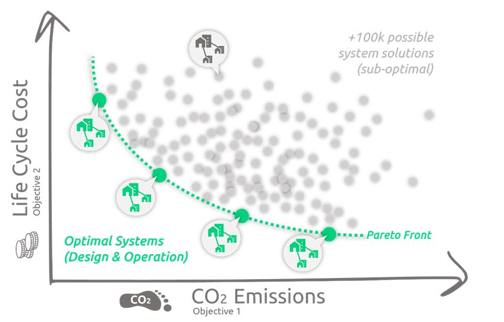
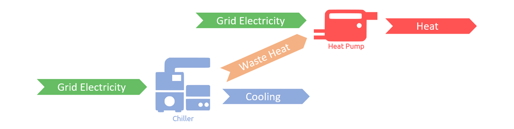

---
tags:
  - web-app
  - troubleshooting
---

# FAQs

Answers to the questions we hear most often: what optimization means and how Sympheny applies it, how the demand profiles are built, and why a result sometimes differs from what you expected. If your question isn't here, [contact support](index.md).

## What are the biggest challenges when planning a complex energy system? And why do we need optimization?

Planning complex energy systems with sector coupling is more challenging than typical centralized energy systems. In terms of modeling, the degrees of freedom have become overwhelming. As a result, only simulating a few sets of system designs (i.e., rule-based search) to determine the optimal system design and operation runs the risk of missing out on optimal solutions. Although one could guarantee optimality by potentially iterating all possible system designs (i.e., brute-force search), such an approach is confined to small-scale systems because the number of possible solutions grows exponentially as the site grows.

To identify optimal solutions, Sympheny's solver uses mathematical optimization. Relative to traditional methods, this approach not only guarantees optimality of results but also effectively handles large-scale systems. Sympheny is a powerful energy system optimization tool that streamlines the process of creating a mathematical model and solving it, letting you focus on designing the best system possible.

## What is mathematical optimization? And how does Sympheny apply it?

Mathematical optimization is a sophisticated analytical tool that lets you describe complex real-world problems in a mathematical model and find a solution that optimizes an objective while adhering to user-defined constraints.

It has a wide range of applications in manufacturing, scheduling, transportation, economics, control engineering, marketing, policy modeling, and more. Sympheny uses mathematical optimization to identify cost-effective and emission-minimizing system designs and operation strategies for new and existing sites.

## What is required to prepare and solve an optimization problem?

An optimization problem or model consists of the following elements:

1. **Variables** (e.g., technology capacity variables, production per time step, binary variables (install or not install a technology))
2. **Constraints and bounds** (e.g., max production per time step, max capacity)
3. **Objective function** (e.g., total cost/profit, total emissions)

A typical optimization problem starts by defining the variables in the model. In the case of Sympheny, the variables are technologies, energy carriers, energy networks, etc. Then, constraints of these variables, such as maximum capacity, seasonal operation, and charging/discharging behaviors, are defined. Finally, the objective functions are set.

Once the optimization problem is defined, it is solved mathematically to find the best set of values for all variables that minimize/maximize the objective function while satisfying all constraints in the model.

## How are the hourly demand profiles generated?

The demand profiles in Sympheny are based on different sources depending on the
building use. Consult the [energy demand profile methodology](../concepts/demand-profiles-methodology.md) for more information.

## How can I share a project with another user?

You can share any project with another user by opening the options menu on the three-dot button and clicking **Send Project Copy**.

## How can I give priority to the use of a type of electricity (e.g. grid electricity vs. renewable electricity from PV) for a Conversion Technology?

Within a multiple-input system, priority is a variable of the optimization, so the optimization engine chooses whichever input is most favorable for reaching the objectives of the optimization.

For the best solution in terms of minimizing CO2, this means the optimization always favors renewable electricity over grid electricity (assuming the grid electricity has a higher CO2 intensity than the renewable electricity, which is true in most cases; the exception is very clean grid electricity combined with on-site PV production and batteries with high grey energy).

For the best solution in terms of minimizing life-cycle cost, this means the optimization favors PV when the price of buying grid electricity is higher than selling renewable electricity: it maximizes the internal use of renewable electricity automatically, and chooses renewable electricity (from your PV) over grid electricity for the Heat Pump.
If installing a PV system is too expensive to be favored by the optimization while being necessary in your system design, you can force-install this technology under the **Optimization Options** tab.

## Can a Heat Pump and a Chiller also be installed as a bivalent system?

Yes, it's possible to use the waste heat of a cooling Technology candidate as an input for another Technology candidate (e.g., a Heat Pump). For example, when modeling heat recovery.

## When modeling solar panels, why is the capacity not what I expected?

The capacity of the solar array depends on many factors. You can specify a fixed capacity to force the investment of the technology. You can specify a minimum energy production in kWh/year to ensure all of the available solar resource is used. Make sure that an export for electricity exists, to avoid a limit on the solar capacity based on electricity demand. Review the on-site resource profile for solar energy and make sure there is no units mistake. A small difference in expectations compared to results is often due to the efficiency of the solar PV technology, which may vary depending on panel and inverter model, shading, altitude, etc. Check out the section for [on-site resources](../step-by-step-guide/on-site-resources-step.md) for more information on how to model solar panels.

## I set a fixed capacity, why is the technology capacity different in the results?

If you specify a capacity for a technology, it does not mean that it has to be used up to that capacity. It means the technology has to be installed up to the fixed capacity. To force the usage of the technology, add a constraint on minimum energy production in kWh/year. See if other alternative technologies or resources are used instead and try to find out why they are more competitive than the technology with fixed capacity. Check out the section on [supply technologies](../step-by-step-guide/supply-technologies-step.md) for more information.

## Why do the hourly energy supply profiles in the results not look the same as the hourly energy demand profiles I've selected?

This is due to the clustering of 365 days into fewer typical days. This is a proven method to reduce computation time without affecting the results. For more information, see the section on [clustering profiles](../concepts/clustered-profiles.md).

## How are the demand profiles in the Sympheny database generated?

The [methodology for generating demand profiles](../concepts/demand-profiles-methodology.md) depends on the building type. It is based on the Swiss norms. The database was constructed with the help of the Fraunhofer research institute.

## Can I generate an hourly demand profile for electric vehicles?

Yes, the [RAMP tool for electric mobility](../advanced-workflows/ramp-tool-suite.md) allows users to generate electric mobility profiles for multiple charging station types.
