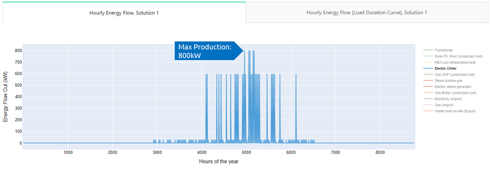

---
tags:
  - web-app
  - troubleshooting
---

# FAQs

What does "optimization" exactly mean, and how is it applied in Sympheny? Our senior software development engineer, Youssef Sherif, answers a few questions that might have popped into your mind.

## What are the biggest challenges when planning a complex energy system? And why do we need optimization?

Planning complex energy systems with sector coupling is more challenging than typical centralized energy systems. In terms of modeling, the degrees of freedom have become overwhelming. As a result, only simulating a few sets of system designs (i.e., rule-based search) to determine the optimal system design and operation runs the risk of missing out on optimal solutions. Although one could guarantee optimality by potentially iterating all possible system designs (i.e., brute-force search), such an approach is confined to small-scale systems because the number of possible solutions grows exponentially as the site grows.

To identify optimal solutions, Sympheny's solver uses mathematical optimization. Relative to traditional methods, this approach not only guarantees optimality of results but also effectively handles large-scale systems. Sympheny is a powerful energy system optimization tool that streamlines the process of creating a mathematical model and solving it, letting you focus on designing the best system possible.

## What is mathematical optimization? And how does Sympheny apply it?

Mathematical optimization is a sophisticated analytical tool that lets you describe complex real-world problems in a mathematical model and find a solution that optimizes an objective while adhering to user-defined constraints.

It has a wide range of applications in manufacturing, scheduling, transportation, economics, control engineering, marketing, policy modeling, and more. Sympheny uses mathematical optimization to identify cost-effective and emission-minimizing system designs and operation strategies for new and existing sites.

## What is required to prepare and solve an optimization problem?

An optimization problem or model consists of the following elements:

1. **Variables** (e.g., technology capacity variables, production per time step, binary variables (install or not install a technology))
2. **Constraints and bounds** (e.g., max production per time step, max capacity)
3. **Objective function** (e.g., total cost/profit, total emissions)

A typical optimization problem starts by defining the variables in the model. In the case of Sympheny, the variables are technologies, energy carriers, energy networks, etc. Then, constraints of these variables, such as maximum capacity, seasonal operation, and charging/discharging behaviors, are defined. Finally, the objective functions are set.

Once the optimization problem is defined, it is solved mathematically to find the best set of values for all variables that minimize/maximize the objective function while satisfying all constraints in the model.

## How can I share a project with another user?

You can share any project with another user by opening the options menu on the three-dot button and clicking **Send Project Copy**.

## How can I give priority to the use of a type of electricity (e.g. grid electricity vs. renewable electricity from PV) for a Conversion Technology?

Within a multiple-input system, priority is a variable of the optimization, so the optimization engine chooses whichever input is most favorable for reaching the objectives of the optimization.

For the best solution in terms of minimizing CO2, this means the optimization always favors renewable electricity over grid electricity (assuming the grid electricity has a higher CO2 intensity than the renewable electricity, which is true in most cases — except, for example, if you have very clean electricity from the grid and on-site production with PV and batteries with high grey energy).

For the best solution in terms of minimizing life-cycle cost, this means the optimization favors PV when the price of buying grid electricity is higher than selling renewable electricity: it maximizes the internal use of renewable electricity automatically, and chooses renewable electricity (from your PV) over grid electricity for the Heat Pump.
If installing a PV system is too expensive to be favored by the optimization while being necessary in your system design, you can force-install this technology under the **Optimization Options** tab.

## Can a Heat Pump and a Chiller also be installed as a bivalent system?

Yes — it's possible to use the waste heat of a cooling Technology candidate as an input for another Technology candidate (e.g., a Heat Pump).

## Why is the maximal energy produced by a Technology Candidate higher than the Optimal Capacity given in the results system diagram?

This is because the Optimal Capacity given in the system diagram represents the capacity of the (selected) primary output, while the output given in the results plot "Energy Flow Out" is the combined output.

In the example below, the Chiller candidate is dimensioned to an Optimal Capacity of 420 kW, but the maximal production in the results plot is 800 kWh/h for the combined outputs (Cooling and Waste Heat):

