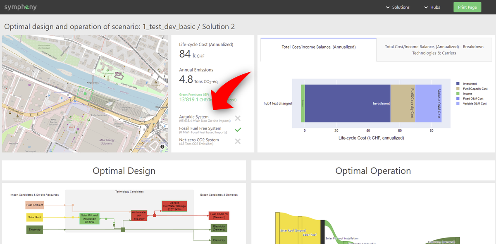

---
tags:
  - web-app
  - release-notes
---

# June 2022

## How to model specific technologies

A new section in the user guide is added with detailed explanations of how to model specific Technology candidates, such as:

- Heat Pumps
- Electrical Chiller
- Reversible Heat Pump
- Groundwater Heat Pump
- Geothermal Heat Pump
- Wastewater Heat Pump
- Free Cooling
- Ice Storage

## Sustainability labels

In [scenario results](../how-to/scenario-results.md) you can now find relevant sustainability labels achieved by your optimized energy system. More labels will be added soon.

