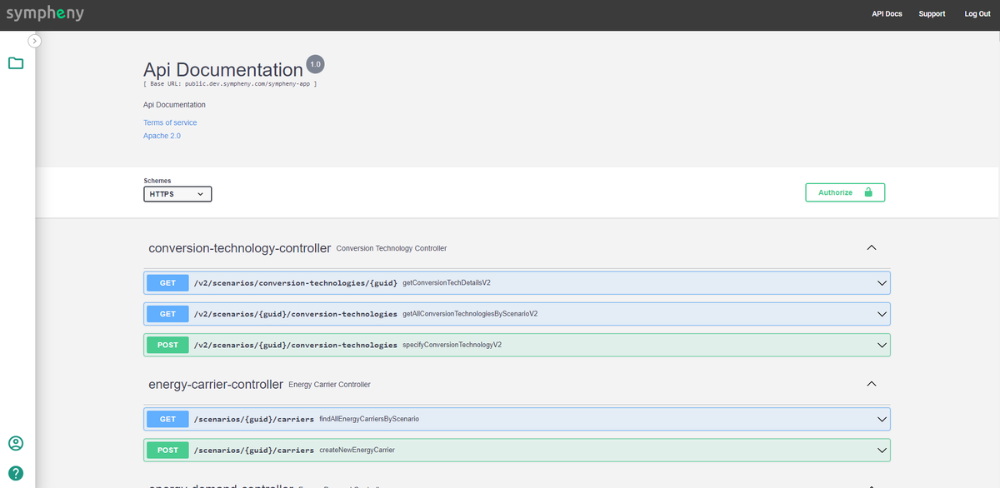

---
tags:
  - web-app
  - release-notes
---

# September 2022

## New navigation page for projects

Geolocate and organize all your projects at once on the same map. Order projects easily by name, favorite, or date created. A new sidebar gives access to the main sections of your project: *Design*, *Execution*, and *Results* of your scenario optimizations.

<video controls preload="metadata" src="https://prod-eu-north-1-sympheny-public.s3.eu-north-1.amazonaws.com/docs/videos/navigation-page.mp4"></video>

## CO2 Capture Technology candidates

Evaluate Technology candidates in your scenario optimization that are able to capture and/or emit CO2 in their operation. CO2 streams can also be modelled to consider more complex CCS (Carbon Capture and Storage) systems.

<video controls preload="metadata" src="https://prod-eu-north-1-sympheny-public.s3.eu-north-1.amazonaws.com/docs/videos/co2-capture-technologies.mp4"></video>

## Upload and download geojson layers in/from the map

Add GIS datasets (geojson) with basic geometry, building, and infrastructure information to the map of your scenario. Download the same data (geojson) and the information included for each energy hub of your scenario.

<video controls preload="metadata" src="https://prod-eu-north-1-sympheny-public.s3.eu-north-1.amazonaws.com/docs/videos/geojson-layers-upload-download.mp4"></video>

## Add building data (in Excel) to the map

Directly upload your own building data based on the EGID identifier from Excel to the GIS map of Sympheny.

<video controls preload="metadata" src="https://prod-eu-north-1-sympheny-public.s3.eu-north-1.amazonaws.com/docs/videos/building-data-excel-to-map.mp4"></video>

## New API service

Integrate the Sympheny optimization engine and other services in your own software application.

