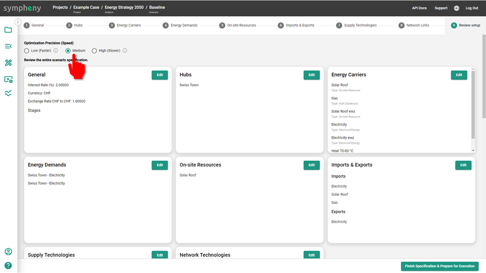

---
tags:
  - web-app
  - release-notes
---

# January 2023

## Peak shaving of energy demand profiles

Upload an energy demand profile as an aggregation of several profiles and perform stochastic peak shaving on the demand profile. [Learn more](../how-to/modeling-scenarios/energy-demands-step.md)

<video controls preload="metadata" src="https://prod-eu-north-1-sympheny-public.s3.eu-north-1.amazonaws.com/docs/videos/peak-shaving-demand.mp4"></video>

## Control granularity (and speed) of the optimization

Choose between three different speeds for the execution of your optimization. The granularity/precision of the optimization results changes depending on the speed selected. [Learn more](../how-to/executing-scenarios.md)

## Hourly efficiencies for Conversion Technologies

Upload an Excel file of different energy efficiencies per hour for your Conversion Technology candidates.

<video controls preload="metadata" src="https://prod-eu-north-1-sympheny-public.s3.eu-north-1.amazonaws.com/docs/videos/hourly-conversion-efficiencies.mp4"></video>

## Updated EV batteries to run overnight

EV batteries can now be plugged in and out overnight, from one day to the next.

## Updated API to execute and get results outside the Sympheny web app

Execute, monitor, and get the results of your energy system optimization externally using your own software/platform instead of using the Sympheny web app.

## Receive example projects in your account

The Sympheny team can send you project examples relevant to your type of project, to help you understand the modelling possibilities for your specific case.

## New plots of total investments in results dashboard

- Total investments per optimal solution
- Total investments per energy hub
- Total investments per energy hub and technology

<video controls preload="metadata" src="https://prod-eu-north-1-sympheny-public.s3.eu-north-1.amazonaws.com/docs/videos/total-investment-plots.mp4"></video>

## Interface language in German

More languages are coming soon.

## Undo & redo actions in your scenario

Return to previous actions while you model your scenario. Only available for some windows; it will be available for all sections soon.

<video controls preload="metadata" src="https://prod-eu-north-1-sympheny-public.s3.eu-north-1.amazonaws.com/docs/videos/undo-redo-actions.mp4"></video>
