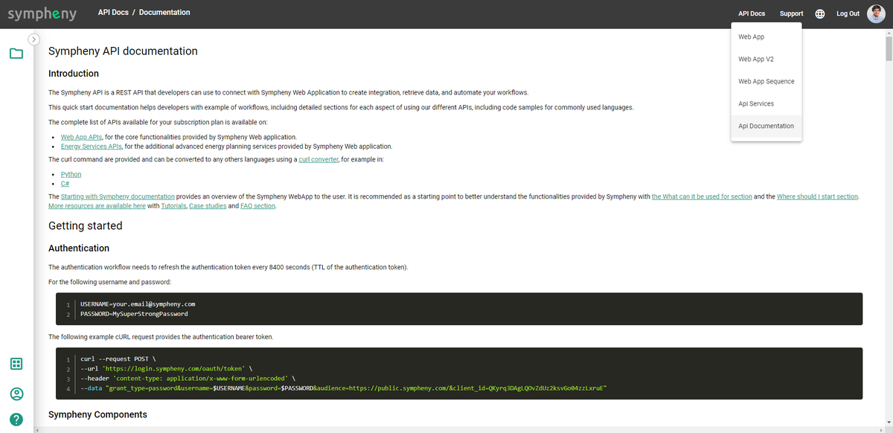
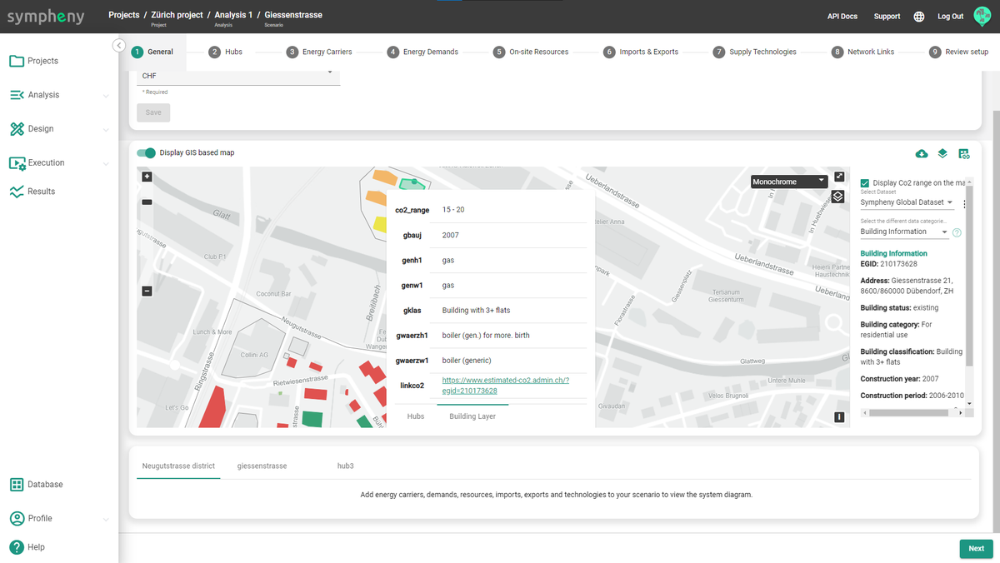

---
tags:
  - web-app
  - release-notes
---

# March 2023

## Database Center

Update or replace all the different types of databases of your organization or your user at once with an Excel file. You can also download all the databases as an Excel file. [Learn more](../how-to/database-center/index.md)

<video controls preload="metadata" src="https://prod-eu-north-1-sympheny-public.s3.eu-north-1.amazonaws.com/docs/videos/database-center.mp4"></video>

## Share projects with other users

Share your projects with your colleagues or other users so you can collaborate with them easily. [Learn more](../how-to/managing-projects.md)

<video controls preload="metadata" src="https://prod-eu-north-1-sympheny-public.s3.eu-north-1.amazonaws.com/docs/videos/share-projects.mp4"></video>

## API documentation

The documentation of how to use the Sympheny API in your own application is now available from the navigation bar of the Sympheny web app.

## Visualize geoadmin data

Visualize geoadmin data in Switzerland provided by the BAFU, such as CO2 emissions for each of the selected buildings in your site's hubs.

