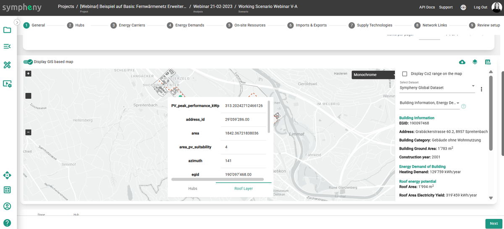
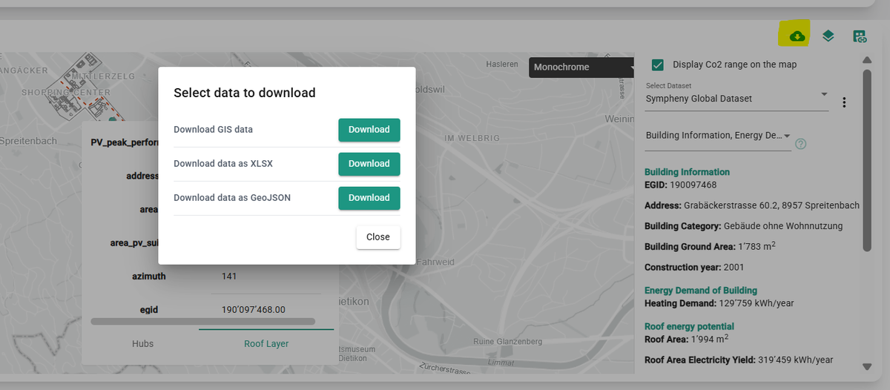
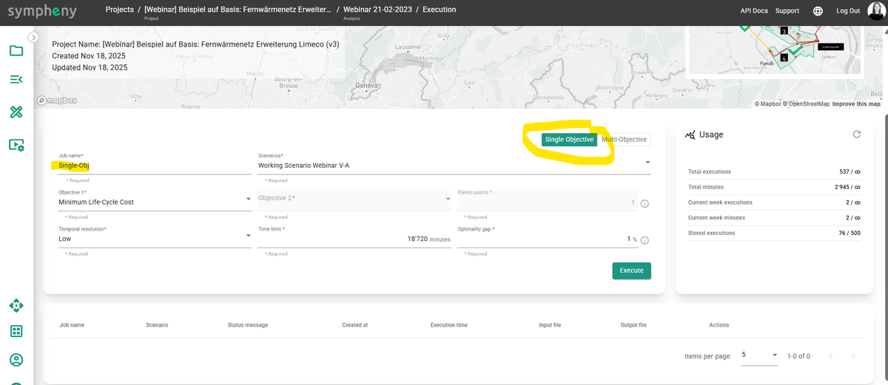
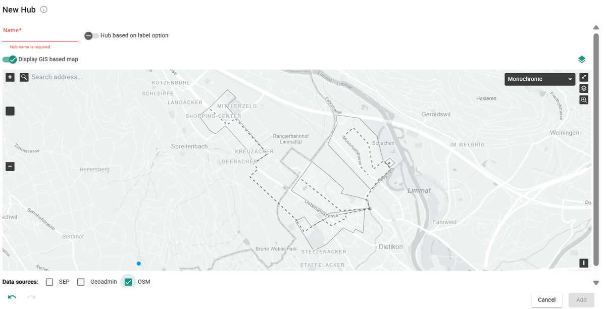
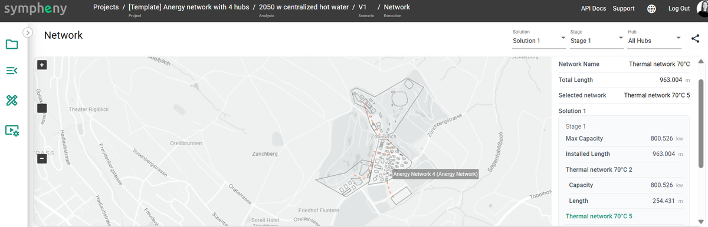
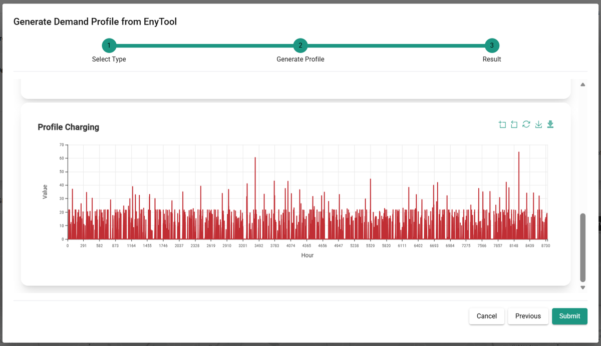
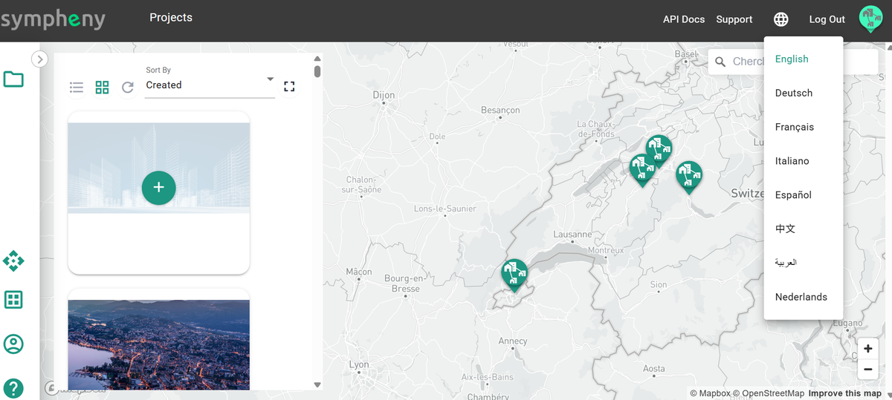

---
tags:
  - web-app
  - release-notes
---

# November 2025

**Sympheny: energy-model faster. See more. Share better.**

Sympheny deployed a set of upgrades that make it easier to prepare data, run focused optimizations, and communicate results — at building, site, and district scales.

## What's new at a glance

- **Download GIS data (now with building-level detail).** Export the spatial layers you create in Sympheny — complete with per-building attributes — for downstream GIS, CAD, or reporting workflows.

  
  

- **Single-objective runs.** Run scenarios against one chosen objective (e.g., cost or CO₂) when you want a fast, focused answer.

  

- **Global OpenStreetMap queries.** Pull international OSM layers directly in Sympheny to accelerate site setup anywhere in the world.

  

- **Network visualization + KPIs (Dashboard v3).** See optimized networks on the map and track headline KPIs (e.g., cost, CO₂, capacities) at a glance.

  

- **EnyMap (light mode).** Create scenarios from a simple Excel input file — perfect for rapid "what-if" variants without full model authoring.

- **EnyTool.** A companion toolkit for power users to automate data prep and batch scenario runs. See [EnyTool](../how-to/enytool/index.md).

  

- **Multi-language UI.** Use Sympheny in multiple languages (initially including English, German, French, and Italian), with easy switching per user.

  

## Benefits

- **Less prep time:** bring in global context fast and export clean GIS for stakeholders.
- **Faster answers:** single-objective runs speed up iteration.
- **Clear storytelling:** network views and KPIs turn results into decisions.
- **Scale your workflow:** EnyMap and EnyTool enable variant generation and automation.
- **Work your way:** collaborate across teams and regions with a multi-language interface.
