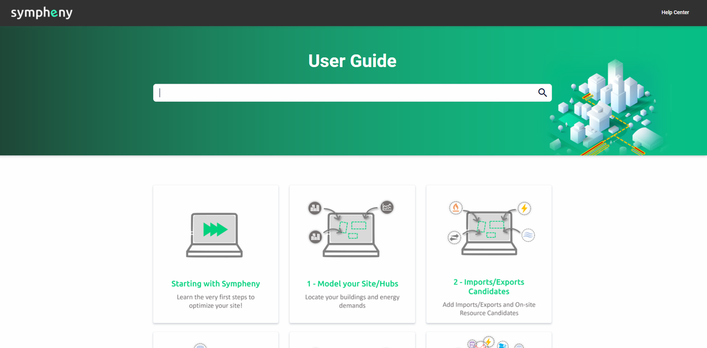

---
tags:
  - web-app
  - release-notes
---

# March 2022

## GIS definition of your urban site

[Watch: GIS definition of your urban site](https://www.youtube.com/watch?v=w-XKBjAswL0&ab_channel=UrbanSympheny)

## SEP GIS data (add-on)

### How to show the data of selected buildings?

[Watch: showing data of selected buildings](https://www.youtube.com/watch?v=dUMKo3XbN58)

### How many buildings can I query?

Each add-on subscription gives access to a specific number of building queries. The current add-on subscription packages are the following:

- SEP Add-on Small: access to information for 1 to 1,000 buildings
- SEP Add-on Medium: access to information for 1,000 to 50,000 buildings
- SEP Add-on Large: access to information for 1,000 to 50,000 buildings

The amount of remaining building queries according to the selected subscription can be read from the My Profile window.

### What type of data is available?

With the SEP add-on for Sympheny, you can get the data you need directly from the embedded GIS map on the web app. SEP provides data from its catalogue directly in Sympheny, including:

- Building area and building category
- Yearly heating and hot water demand of the building
- Roof geometries of the building
- Facade geometries of the building
- If available: Minergie data, including standard and Minergie energy reference area

## On-site resource candidates

Sympheny's step 4 Solar Resources is now **On-site Resources**. This means you can integrate hourly energy profiles for any type of On-site Resource candidate: *Wind*, *Tidal*, *Process waste heat*, or any other user-defined energy carrier.

<video controls preload="metadata" src="https://prod-eu-north-1-sympheny-public.s3.eu-north-1.amazonaws.com/docs/videos/on-site-resource-candidates.mp4"></video>

## Add on-site resources directly from the GIS map

Now you can select the available resource area of your urban site and automatically assign the on-site resource potential profile in kW/m2.

<video controls preload="metadata" src="https://prod-eu-north-1-sympheny-public.s3.eu-north-1.amazonaws.com/docs/videos/add-solar-resources-from-map.mp4"></video>

## New plots in results dashboard

- Plot of total cost/income balance with cost breakdown of technologies
- The same plot across the hubs of the system
- Plot of imports vs. exports & demand of the system
- Plot of on-site resources results

<video controls preload="metadata" src="https://prod-eu-north-1-sympheny-public.s3.eu-north-1.amazonaws.com/docs/videos/results-dashboard-new-plots.mp4"></video>

## New Help Center (user guide, tutorials, etc.)

With this new portal it's now easier to navigate through all the documentation and resources available about Sympheny software.

